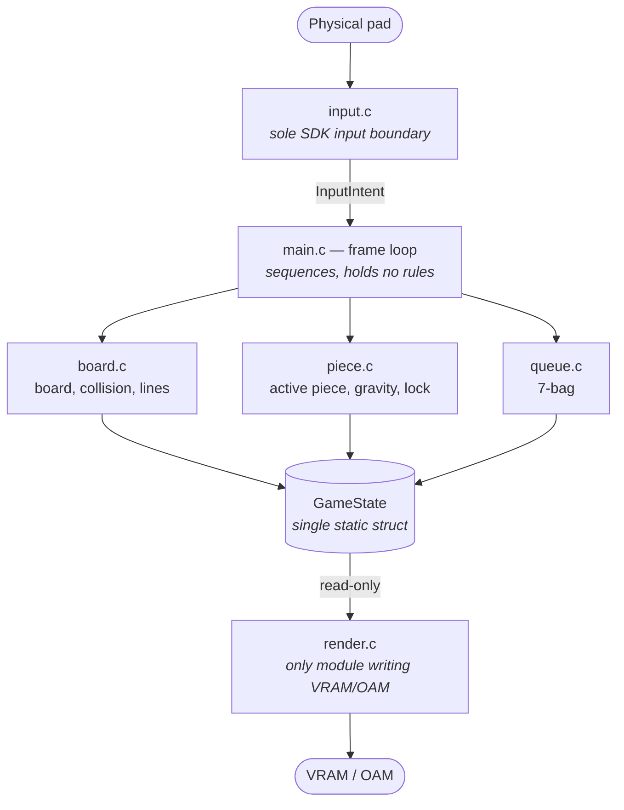

# SNES Technical Demo

A native Super Nintendo (65816) technical demonstration written from scratch in C on
PVSnesLib, built around a three-level validation pipeline, on-target instrumentation and
reproducible-build tooling.

The running program is a block-stacking playfield: pieces fall, can be moved, lock on
landing, and completed rows collapse. The gameplay is the vehicle; the engineering
substance is the architecture, the hardware constraints it works within, and the
verification process built to make correctness provable on a platform with no debugger.

> **Status:** minimum declared scope implemented; the final work unit is awaiting manual
> emulator sign-off. See [Current Implementation Status](#current-implementation-status).

<!-- TODO: badges — no CI, no license file and no release tags exist yet. Add build and
     license badges once those exist. -->

---

## Demonstration Video

▶ **https://www.youtube.com/watch?v=4nHm8aOxy1A**

<!-- TODO: still screenshots. None exist in the repository; the only PNGs are 8x8 source
     art assets consumed by the build. -->

---

## Overview

The SNES has no operating system, no dynamic allocation, no threads and no filesystem.
There is no debugger attached to the running program: no `printf` to a console, no
breakpoints, no stack traces. Video memory writes issued while the display is active are
not rejected with an error — they are silently discarded by the hardware. The resource
budget is fixed and small: 128 KB of work RAM, 64 KB of VRAM, a 256 KB ROM.

This repository is an exercise in building software under exactly those conditions, and in
building the observability the platform does not provide:

- A **strict simulation/presentation split**, so game rules can be verified by reading
  memory rather than by looking at pixels.
- **On-target instrumentation** — a small versioned status struct published at a known WRAM
  address so an external process can observe the program while it runs.
- **An automated verification harness** that runs the ROM in an emulator, reads its memory
  frame by frame from a Lua probe, and returns a pass/fail exit code.
- **Reproducible-build tooling** that rebuilds the ROM from scratch in a throwaway copy and
  compares it byte-for-byte with the one in the tree.
- **Mechanical scope containment**, so what a change is allowed to touch is enforced by a
  tool rather than by discipline.

### Origins and acknowledgements

The game logic is informed by [Apotris](https://akouzoukos.itch.io/apotris) by
[akouzoukos](https://github.com/akouzoukos), a guideline-compliant block-stacking game
written in C++ for the Game Boy Advance (devkitARM + libtonc), distributed under the GNU
GPL v3.

This repository is **not a port of it**. The GBA sources are kept locally as a read-only
reference and are neither redistributed here nor tracked in version control. Where an
algorithm or data table from those sources was adapted, the adapting function carries a
source comment naming the original function and line range. C++ constructs (classes,
`std::list`, `std::tuple`) have no equivalent in the target toolchain and are never
translated syntactically.

The build artefacts are still named `apotris.sfc` / `apotris.sym` for historical reasons;
renaming them is a build change, not a documentation change, and has not been done.

---

## Current Implementation Status

The minimum scope declared at project start — board, active piece, spawn, horizontal
movement, gravity, collision, lock, next piece, line clear — is **implemented**.

The final work unit (line clear wired into the lock cycle) has passed compilation (V0),
automated verification (V1) and independent review, and is **pending manual emulator
validation (V2)**.

| Metric | Value |
|---|---|
| Documented work units | 24 |
| C and header lines in the ROM | ~1,380 |
| Python process and harness tooling | ~1,040 lines |
| ROM size | 256 KB (262,144 bytes), LoROM / SlowROM |
| Hand-written assembly | none — no measured bottleneck has justified it |

### Implemented

**Gameplay**

- 10 × 22 logical board (20 visible rows + 2 spawn buffer rows), statically allocated.
- Collision against borders, floor and occupied cells, evaluated over the piece's full
  4 × 4 shape.
- All seven tetromino shapes (rotation 0), dealt by a **7-bag randomiser** using a
  Fisher–Yates shuffle.
- Spawn, single-step horizontal movement, automatic gravity on a fixed frame interval,
  landing detection and lock.
- Full-row detection and collapse, sequenced between the lock and the board redraw so a
  completed row is never drawn on screen.

**Presentation**

- Active piece drawn as up to four OAM sprites, repositioned every frame.
- Settled board drawn from a WRAM mirror of the playfield tilemap, pushed to VRAM by DMA
  **only on lock** — never on movement or gravity.
- Text console overlay used as on-target debug output.

**On-target test infrastructure** (not gameplay)

- `TestStatus` — a small, flat, versioned struct published at a known WRAM address, with a
  magic handshake (`0x5453`) chosen to be distinguishable from the `0x55` fill pattern
  bsnes leaves in uninitialised WRAM.
- `test_runner` — a minimal IDLE → RUNNING → PASS/FAIL state machine, the only component
  authorised to write `TestStatus`. No assert macros, no suites, no function pointers.

### Not implemented

- **No game over.** When the stack reaches the spawn area the simulation stops advancing;
  from the outside it is indistinguishable from a hang. Recorded and confirmed by direct
  observation; it belongs to no planned work unit, because the original roadmap did not
  cover it.
- **No rotation.** Pieces exist only in their rotation-0 shape; no SRS, no wall kicks.
- **No soft or hard drop.** `InputIntent` carries a `down` field the frame loop does not
  consume yet.
- **Gravity is a fixed 30-frame interval**, not the per-level Q8.8 curve the requirements
  call for.
- **No lock delay, no scoring, no combo, no levels, no clear animation, no audio, no
  menus.**
- **The first bag is identical on every run.** PVSnesLib exposes `rand()` but no `srand()`,
  so the generator restarts the same stream after reset. The program burns one value per
  frame and refills the bag lazily, which varies every bag *after* the first — but the
  first is filled before the player can provide any input. Closing this needs a real
  entropy source seeded at a title screen, and there is no title screen.
- `board_collapse_lines()` cannot clear row 0; if it ever filled, it would stay filled.
  Documented assumption ("top buffer always empty"), unreachable today.
- `board_detect_full_lines()` truncates at four rows without signalling it. Irrelevant
  while a single lock cannot complete more than four.
- Boot-time debug tests and a live debug text overlay still ship in the ROM.

---

## Architecture Overview

The organising principle is a **strict separation between simulation and presentation**.
Gameplay modules include no video and no input headers; they do not know a screen exists.



### Modules and ownership

| Module | Responsibility | Invariant |
|---|---|---|
| `game_state.h` | The single static `GameState` struct: board, active piece, pending lines, bag | No game state exists anywhere else |
| `board.c` | Board storage, collision, full-row detection and collapse | Sole writer of the board array |
| `piece.c` | Active piece: spawn, movement, gravity, landing, lock | Owns the shape-collision loop |
| `piece_data.c` | Static shape tables | Const data only |
| `queue.c` | 7-bag randomiser | Owns bag internals; `piece.c` does not reach into them |
| `input.c` | Pad translation to an `InputIntent` | Only module touching PVSnesLib pad symbols |
| `render.c` | Sprites, tilemap mirror, DMA | Only module touching VRAM/OAM; read-only over `GameState` |
| `main.c` | Frame loop sequencing | Contains no game rule |

When it became necessary to decide whether a piece had landed, the function was written in
`piece.c` rather than in the loop — that is a rule, and `main.c` holds none.

### Two performance decisions that shape the design

- **Sprites for the falling piece, tilemap for the settled board.** The active piece moves
  every frame and four sprites are cheap to move. The board changes only when a piece
  locks — at most once every few seconds.
- **The tilemap is mirrored in WRAM.** The SDK exposes no single-cell tilemap write
  (investigated and documented under
  `_bmad-output/implementation-artifacts/investigations/`). The pattern, taken from an
  official library example, is to keep a RAM copy, mutate it freely, and DMA the whole map
  right after vertical blank. The transfer is a no-op unless a lock marked the mirror
  dirty, so movement and gravity never trigger DMA.

### Struct field order is load-bearing

`PieceQueue` is deliberately declared last in `GameState`. The V1 probe reads piece and
line state at fixed byte offsets, and inserting a field ahead of them would silently shift
what the harness measures — a failure mode that was observed once and is documented in
[Validation Approach](#validation-approach).

Full design: [`_bmad-output/game-architecture.md`](_bmad-output/game-architecture.md).

---

## Technology Stack

| Area | Tool |
|---|---|
| Target | SNES / 65816, LoROM + SlowROM |
| Language | C (the subset accepted by `816-tcc`) |
| SDK | PVSnesLib (`PVSNESLIB_HOME`) |
| Assembler / linker | `wla-65816`, `wlalink` (wla-dx) |
| Graphics conversion | `gfx4snes`, invoked from the `Makefile` |
| Automated verification | BizHawk 2.11.1 (Mono) driven by Lua, orchestrated from Python 3 |
| Manual validation | ares |
| Host | Ubuntu Linux; Python 3 standard library only, no third-party dependencies |

<!-- TODO: pin the exact PVSnesLib / devkitSNES version. project-context.md flags this as
     pending, and no version string is recorded anywhere in the repository. -->

### Toolchain assumptions that do not hold

Recorded in [`BOOTSTRAP.md`](BOOTSTRAP.md) because each one already produced code that
compiled and then misbehaved:

- **Static storage is not zero-initialised.** The C standard guarantees it; this toolchain
  does not. A static `u8` was measured reading `0x55` — the uninitialised-WRAM fill
  pattern — for an entire run. Every static is now explicitly initialised.
- **`u8`/`s8` are not promoted to 16 bits as varargs.** The console printer consumes two
  bytes per argument, so every argument after the first shifts by a byte without explicit
  widening casts.
- **WRAM addresses are not stable across source changes.** The harness resolves symbols
  from the generated `.sym` file on every run instead of hardcoding addresses.
- `static` symbols appear in the symbol table as `tccs_<file>.asm_<name>`, plain globals do
  not — which matters when locating them from outside the ROM.

### A build that cannot silently link stale assets

`data.asm` embeds converted graphics via `.incbin`. Make does not parse `.incbin`, so it
would only reassemble that object when `data.asm` itself changed — quietly linking last
week's tiles into today's ROM whenever only an asset changed. The `Makefile` declares the
converted assets as prerequisites of that object, without overriding the SDK's compile
recipe.

---

## Build Instructions

### Prerequisites

- PVSnesLib installed, with `PVSNESLIB_HOME` exported (the `Makefile` errors out
  otherwise).
- GNU Make.
- Python 3 (standard library only) for the validation tooling.
- For automated verification: BizHawk 2.11.1 extracted to
  `tools/BizHawk-2.11.1-linux-x64/`, `mono` on `PATH`, and a graphical session.
- For manual validation: [ares](https://ares-emu.net/).

### Build

```bash
cd snes && make
```

Produces `snes/apotris.sfc` (the ROM) and `snes/apotris.sym` (the symbol table the harness
reads). The artefact names are historical — see
[Origins and acknowledgements](#origins-and-acknowledgements).

`make` picks up any new `.c` under `snes/source/` automatically (`snes_rules` globs), so
adding a module does not require editing the `Makefile`.

> **Do not run `make clean` during development.** It removes the ROM left ready for the
> emulator. When a genuinely clean build is needed, use `rebuild_v0.py` below — it builds
> from scratch in a throwaway copy instead.

### Verify the ROM matches its sources

```bash
python3 tools/loop/rebuild_v0.py
```

Exit code 0 only if the clean build succeeded, the resulting ROM matches the one in the
tree, and the tree was left untouched. `--keep` preserves the build directory for
inspection.

---

## Validation Approach

Three levels, measuring different things. **None can substitute for another.**

| Level | What it is | Cost | What it proves |
|---|---|---|---|
| **V0** | Clean build from scratch in a throwaway copy, ROM compared byte-for-byte with the tree | Seconds of machine time | The code compiles, and the ROM corresponds to the sources |
| **V1** | The ROM runs in an emulator, a Lua script reads its memory frame by frame, and a Python process checks the values | ~40 s of machine time | Game rules behave correctly, without looking at the screen |
| **V2** | A person opens the emulator and looks | Minutes of human attention | What is on screen is what should be on screen |

```bash
cd snes && make                              # V0
DISPLAY=:0 python3 tools/harness/harness.py  # V1 — exit 0 = PASS, 1 = FAIL
cd snes && ares apotris.sfc                  # V2
```

**V0 and V1 are mandatory for any change that can alter the ROM**, with no exception by
type of work — their cost is machine time, not attention. What the type of work determines
is whether V2 is *additionally* required.

### Why three and not one

- V0 knows nothing about behaviour. A program that compiles may not boot.
- V1 cannot see. A piece drawn 24 pixels above where it belongs has exactly the same values
  in memory as one drawn correctly.
- V2 neither scales nor reproduces. It depends on a person being available, and cannot run
  hundreds of times.

### How V1 works

`harness.py` runs preflight checks, launches BizHawk with the ROM and the Lua probe, polls
the probe's log, and declares PASS only if all four criteria hold: the memory domain was
declared, at least two reads were recorded, emulation advanced ≥ 180 frames between the
first and last read, and at least one read escaped the `0x55` uninitialised-WRAM pattern —
proving real program state was observed rather than virgin RAM.

The probe reads WRAM at addresses derived from the generated `.sym`, never hardcoded. A
recorded run shows the piece's `y` coordinate incrementing every exactly 30 frames,
independently corroborating the gravity interval implemented in C.

### Reproducible builds, verified rather than assumed

`make` on an already-built tree exits 0 with "nothing to be done". A reviewer running
`make` to "reproduce the build independently" is signing off a no-op.
`tools/loop/rebuild_v0.py` copies `snes/` to a throwaway directory, purges generated
artefacts there, builds from scratch, and compares the resulting ROM byte-for-byte against
the one in the tree. It MD5s every file under `snes/` before and after to prove the main
tree was never touched, and independently re-checks that no `.obj`, `.sfc`, `.sym`, `.pic`
or `.pal` survived the purge — an incomplete ignore list would otherwise let stale objects
produce a false PASS.

A ROM that cannot be rebuilt from its sources is a finding, not a detail: it means what was
validated in the emulator is not what the repository describes.

### Mechanical scope containment

Every work unit declares the exact commit it is measured against **and** the pre-existing
modifications in the working tree. `tools/loop/story_baseline.py` computes
`(files differing from baseline) − (declared pre-existing modifications)` and fails if
anything outside the declared allowlist appears. It also detects files hidden inside
ignored directories and files flagged so version control stops reporting them — two ways to
move a change out of scope without it showing up in a diff.

### Instruments can break silently

One change added a 2 KB buffer to WRAM. That shifted the addresses the verification probe
read by fixed offset. The probe began reading the new buffer, believing it was program
state, and printed frozen values for an entire run — while the harness still reported PASS,
because its criteria (reads happened, frames advanced, state was seen) are satisfied just
as well by garbage. The only signal was that the numbers differed from previous runs.

The resulting rule: **any change that alters memory layout automatically escalates to the
deepest review level**, and address validity is re-checked at every work unit's close.

### Independent review

Implementation and verification are deliberately separated: a reviewer with no access to
the implementer's reasoning re-runs V0, V1 and the scope check rather than trusting the
report. Review depth (A / B / C) is derived mechanically from the class of change, not
chosen by the reviewer, and escalates automatically when a change touches memory layout,
DMA/VRAM/OAM, `tools/`, or the `Makefile`.

Measured cost across three reviews in a single session: ~105k tokens (8 findings), ~92k
(5 findings), ~42k (0 findings, on a 17-line change). What a lighter review drops is
investigation depth — never the checks themselves, and never the reviewer's independence.

Full policy: [`docs/BMAD_GAMEDEV_NATIVE_LOOP.md`](docs/BMAD_GAMEDEV_NATIVE_LOOP.md).
Narrative walkthrough with evidence:
[`docs/ENGINEERING_CASE_STUDY.md`](docs/ENGINEERING_CASE_STUDY.md).

### What does not exist

Declared explicitly so nobody looks for it:

- **No unit test suite.** ROM code is not compiled for the host.
- **No linter or formatter** configured.
- **No CI.** All verification runs locally — V1 needs a graphical session, and this BizHawk
  build has no headless mode (installing `xvfb` would unblock it).
- **V1 measures nothing perceptual.** It cannot see the screen or hear audio. That is
  exactly the boundary between V1 and V2.

---

## Repository Structure

```
.
├── snes/                      # The ROM project — all target code lives here
│   ├── source/                #   C modules: board, piece, piece_data, queue,
│   │                          #   input, render, main, test_status, test_runner
│   ├── *.png                  #   Source art, converted at build time by gfx4snes
│   ├── Makefile               #   Wraps PVSnesLib's snes_rules
│   ├── hdr.asm, data.asm      #   ROM header and embedded binary data
│   └── (generated: .sfc .sym .obj .pic .pal .map .inc) — gitignored
├── tools/
│   ├── harness/harness.py     # V1 orchestrator: BizHawk + Lua + Python
│   ├── lua/                   # Lua probe running inside the emulator
│   └── loop/                  # Process tooling: scope gate, reproducible V0
├── docs/                      # Development-process framework and engineering case study
├── _bmad-output/              # Planning and per-work-unit implementation records
│   ├── project-context.md     #   Binding rules and anti-patterns
│   ├── game-architecture.md   #   Module design, frame loop, VRAM strategy
│   ├── planning-artifacts/    #   FR/NFR inventory, epics, acceptance criteria
│   └── implementation-artifacts/  # One file per work unit, with its evidence
├── BOOTSTRAP.md               # Single entry point: commands, conventions, state
└── CLAUDE.md                  # Operating instructions for AI agents in this repo
```

Two directories are **gitignored and absent from a fresh clone**: `reference/apotris/`
(the original GBA sources, read-only reference) and `tools/BizHawk-2.11.1-linux-x64/`
(the harness emulator, 243 MB).

> Most planning and process documentation is written in Spanish. Source code, code comments
> and this README are in English.

### Where to start reading

1. [`docs/ENGINEERING_CASE_STUDY.md`](docs/ENGINEERING_CASE_STUDY.md) — what was built, what
   went wrong, and what the evidence showed (Spanish).
2. [`BOOTSTRAP.md`](BOOTSTRAP.md) — commands, path conventions, current process state.
3. [`_bmad-output/game-architecture.md`](_bmad-output/game-architecture.md) — module design.
4. The framework documents under `docs/` — only if you want the full process specification.

---

## Roadmap

Ordered by what the repository actually commits to.

**Immediate**

1. Manual emulator validation (V2) of the line-clear integration, closing the minimum
   scope.
2. Game-over / top-out handling — the most visible functional gap, and not yet attached to
   any planned work unit.

**Declared in the requirements, not yet implemented**

3. Per-level Q8.8 gravity curve (FR5 is currently satisfied only as a fixed interval), with
   tables converted offline from float values.

**Process work required before the first epic closes**

4. A durable aggregate registry for deferred findings and manual-validation debt; both are
   currently recorded in the individual work-unit files.
5. A state vocabulary that distinguishes "implementer still working" from "review running".
6. Sprint status tracked as repository data rather than as a human decision.

**Beyond the declared minimum scope** — explicitly outside current planning, listed so the
gap is visible: piece rotation and kick tables, soft/hard drop, lock delay, scoring and
combo, level progression, next-piece preview, hold, HUD, audio, additional game modes.

Multiplayer link cable, rumble, flash saves and replays are **out of scope by decision**,
not by omission.

---

## Contributing

This is a personal portfolio project and is not currently accepting external contributions.
Issues pointing out technical errors are welcome.

If you do work in this repository, the binding rules are:

- Read [`BOOTSTRAP.md`](BOOTSTRAP.md) first — it is the single entry point for commands,
  path conventions and current process state.
- Implement only the current work unit. No speculative abstractions; the smallest
  implementation that satisfies the acceptance criteria.
- Never translate C++ constructs from the reference sources syntactically — adapt the logic
  and the data tables, and cite the original in a source comment.
- Do not edit generated paths (`snes/*.sfc`, `*.sym`, `*.pic`, `*.pal`, `*.map`, `*.inc`,
  `*_data.as`, `source/*.obj`) or BMAD artefacts (`project-context.md`,
  `game-architecture.md`).
- Every change that can alter the ROM runs V0 and V1 before it is considered done.
  Compiling is not done. A harness PASS is not done either.

---

## License

<!-- TODO: no LICENSE file exists in this repository. -->

**This repository currently has no license file**, which means no usage rights are granted.
This needs resolving before the repository is made public.

The reference project this work adapts algorithms and data tables from is distributed under
the **GNU GPL v3**, which makes the licensing choice here a decision to be taken
deliberately rather than left blank. See
[Origins and acknowledgements](#origins-and-acknowledgements).
