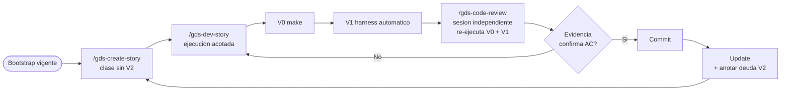
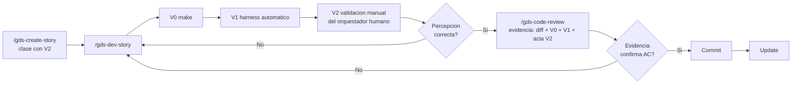
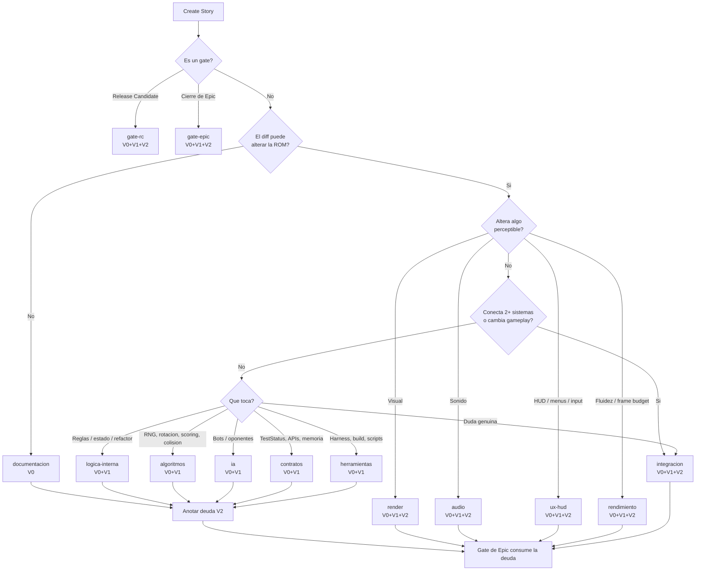
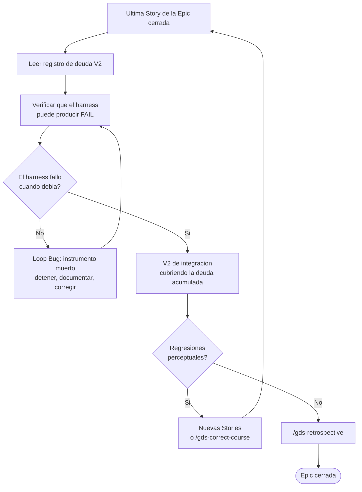

# BMAD Game Dev Native Loop — Capa de adaptación

| | |
|---|---|
| **Versión** | v1.1 (capa de adaptación) |
| **Estado** | **Listo para adopción** — operativo una vez completados los [Requisitos para adopción](#requisitos-para-adopción) |
| **Fecha** | 2026-07-25 |
| **Alcance** | Adaptación del BMAD Native Loop a proyectos BMAD Game Development Studio |
| **Documento base** | `docs/BMAD_NATIVE_LOOP.md` v1.3 (**no se modifica**) |
| **Ubicación canónica** | `docs/BMAD_GAMEDEV_NATIVE_LOOP.md` |
| **Módulos BMAD verificados** | Core 6.10.0, Game Dev Studio v0.6.0 |

> Este documento **no reemplaza ni redefine** el BMAD Native Loop. Es una capa de adaptación: traduce los comandos del framework al catálogo de BMAD Game Development Studio, y describe cómo se instrumenta la fase de verificación cuando un proyecto de videojuegos ya dispone de infraestructura de pruebas automatizada. Ante cualquier conflicto de interpretación, **prevalece `docs/BMAD_NATIVE_LOOP.md`**.

---

# Qué queda intacto

Esta capa **no toca** ninguno de los siguientes elementos del framework. Se listan explícitamente para que la ausencia de cambios sea verificable, no supuesta:

| Elemento del framework | Estado en esta capa |
|---|---|
| Flujo de cinco fases (Create Story → Dev Story → Review → Commit → Update) | **Sin cambios** |
| Orden de autoridad (árbol > verificación > Review > autorreporte) | **Sin cambios** |
| Roles y responsabilidades | **Sin cambios** |
| Taxonomía de incidencias (Loop Bug / Operational Incident / Executor Friction) | **Sin cambios** |
| Disposiciones de hallazgo (`patch` / `defer` / `decision-needed` / `Rejected by Design`) | **Sin cambios** |
| Operational Readiness (criterios de entrada, salida y evaluación continua) | **Sin cambios** |
| Principios operativos 1–7 | **Sin cambios** |
| Criterios para modificar el loop y umbral de escalamiento | **Sin cambios** |
| Gate de Bootstrap y su alcance de evaluación | **Sin cambios** |
| Aislamiento entre ejecución y verificación | **Sin cambios** |
| Baseline de comparación | **Sin cambios** |

Lo único que esta capa aporta es: **(a)** qué comando concreto ejecuta cada fase en un proyecto GDS, y **(b)** con qué instrumentos se produce la evidencia de la fase de verificación. Ambas cosas son, por diseño del framework, plano de **proyecto**, no de framework.

---

# Objetivo 1 — Equivalencias de comandos

## Método de verificación del catálogo

El principio operativo 7 del framework prohíbe fabricar fuentes. Los nombres de esta sección **no** se derivan de memoria ni de documentación externa. Se leyeron de tres fuentes locales del repositorio:

| Fuente | Qué aporta |
|---|---|
| `_bmad/_config/manifest.yaml` | Qué módulos BMAD están instalados y en qué versión |
| `_bmad/_config/bmad-help.csv` | Catálogo global unificado (Core + Game Dev Studio) |
| `_bmad/gds/module-help.csv` | Catálogo del módulo Game Dev Studio, con fase y cadena `preceded-by` |
| `.claude/skills/` | Skills realmente invocables en este entorno |

Todo comando citado abajo existe en al menos dos de esas fuentes. Ningún nombre se inventó, y las dudas quedan marcadas como **PENDIENTE** en lugar de resolverse por inferencia.

## Hallazgo previo: los comandos `/bmad-*` de la tabla del framework no están instalados

La tabla "Comandos BMAD asociados al loop" del framework nombra `/bmad-create-story`, `/bmad-dev-story`, `/bmad-code-review` y `/bmad-generate-project-context`. En este entorno **ninguno de los cuatro existe**: no aparecen en `.claude/skills/`, ni en `_bmad/core/module-help.csv`, ni en el catálogo global.

El módulo Core instalado (6.10.0) no incluye workflows de Story. Los únicos que implementan esas fases son los del módulo Game Dev Studio.

Consecuencia práctica: para un proyecto GDS, la instrucción "si no existe equivalente, mantener el comando estándar" **no es aplicable a esas cuatro fases**, porque el comando estándar tampoco está disponible. El equivalente GDS no es una preferencia: es la única implementación presente.

> **PENDIENTE.** No se pudo verificar si los nombres `/bmad-create-story`, `/bmad-dev-story` y `/bmad-code-review` corresponden a otro módulo BMAD no instalado aquí (por ejemplo un módulo de método general). Determinarlo requiere consultar el catálogo oficial de BMAD, fuera del alcance local. Hasta entonces esta capa no afirma nada sobre su existencia en otros entornos.

## Tabla de equivalencias por fase del loop

| Fase del loop | Comando del framework | Equivalente Game Dev Studio | Menu code | Fase GDS | Estado |
|---|---|---|---|---|---|
| Gate de Bootstrap (consulta) | `/bmad-help` | — | `BH` | anytime | **Se mantiene el comando estándar.** No existe `gds-help`. `bmad-help` ya lee `_bmad/gds/module-help.csv`, así que cubre el catálogo GDS sin adaptación |
| Gate de Bootstrap (generación) | `/bmad-generate-project-context` | `/gds-generate-project-context` | `PC` | 3-technical | Equivalente directo verificado |
| Create Story | `/bmad-create-story` | `/gds-create-story` | `CS` | 4-production | Equivalente directo verificado |
| Dev Story | `/bmad-dev-story` | `/gds-dev-story` | `DS` | 4-production | Equivalente directo verificado |
| Review | `/bmad-code-review` | `/gds-code-review` | `CR` | 4-production | Equivalente directo verificado |
| Commit | — | — | — | — | **Sin equivalente en ningún módulo.** Acción de control de versiones; fuera del catálogo por definición, igual que en el framework |
| Update | — | — | — | — | **Sin equivalente en ningún módulo.** `gds-retrospective` (`ER`) opera a nivel de Epic, no de Story, y por tanto no lo sustituye — exactamente el mismo razonamiento que el framework aplica a `/bmad-retrospective` |

## Comandos GDS adicionales relevantes al loop

Estos no reemplazan ninguna fase, pero un proyecto GDS los usa alrededor del loop. Se listan porque conocerlos evita el error de improvisar un paso que ya tiene comando oficial.

| Comando | Menu code | Fase GDS | Rol respecto al loop |
|---|---|---|---|
| `/gds-sprint-planning` | `SP` | 4-production | Genera/actualiza `sprint-status.yaml`. Es el `preceded-by` declarado de `gds-create-story`: sin él, la fuente de candidatos del Bootstrap no existe |
| `/gds-sprint-status` | `SS` | 4-production | Consulta de progreso y riesgos. Insumo del paso Update |
| `/gds-create-epics-and-stories` | `CE` | 3-technical | Produce la fuente de candidatos que el Bootstrap exige declarar |
| `/gds-check-implementation-readiness` | `IR` | 3-technical | Alineación GDD/UX/Arquitectura/Epics antes de producción. Refuerza el gate de Bootstrap, no lo sustituye |
| `/gds-game-architecture` | `GA` | 3-technical | Produce el artefacto de arquitectura que el Bootstrap referencia |
| `/gds-investigate` | `IN` | 4-production | Investigación forense con hallazgos graduados por evidencia. Vía correcta cuando una Story se bloquea por una causa desconocida, en lugar de que el ejecutor improvise hipótesis |
| `/gds-correct-course` | `CC` | anytime | Cambio significativo a mitad de sprint. Es la salida ordenada cuando una Story deja de ser válida, en lugar de expandir su alcance |
| `/gds-retrospective` | `ER` | 4-production | Retrospectiva de Epic. Consumidor natural del registro que produce Update |
| `/gds-quick-dev` | `QD` | anytime | Flujo de un solo paso: aclarar, planificar, implementar y revisar. **Fuera del BMAD Native Loop:** colapsa ejecución y verificación en un mismo proceso, lo que viola el aislamiento entre fases (principio operativo 6). Útil como herramienta suelta; no es una fase del loop |

## Comandos GDS de la fase `gametest`: aplicabilidad no verificada

El módulo GDS declara una fase `gametest` con cinco comandos. Su aplicabilidad a un proyecto SNES nativo en C **no está verificada** y no debe asumirse:

| Comando | Menu code | Observación |
|---|---|---|
| `/gds-test-framework` | `TF` | El catálogo lo describe explícitamente como *"for Unity Unreal Engine or Godot projects"*. **No aplicable** a un proyecto que no usa esos motores |
| `/gds-test-design` | `TD` | Descripción genérica (escenarios de prueba de gameplay/progresión). **PENDIENTE:** aplicabilidad no verificada; declara `gds-test-framework` como `preceded-by`, que no aplica aquí |
| `/gds-test-automate` | `TA` | **PENDIENTE:** aplicabilidad no verificada. No se inspeccionó el workflow |
| `/gds-e2e-scaffold` | `ES` | **PENDIENTE:** aplicabilidad no verificada. Declara `gds-test-automate` como `preceded-by` |
| `/gds-test-review` | `TR` | **PENDIENTE:** aplicabilidad no verificada |
| `/gds-playtest-plan` | `PP` | Plan de playtesting estructurado. Relevante para la validación manual de integración descrita en el Objetivo 2, pero su encaje concreto **no está verificado** |
| `/gds-performance-test` | `PT` | Estrategia de rendimiento. Relevante para los disparadores de validación manual; encaje **no verificado** |

Un proyecto que construye su propia infraestructura de pruebas (harness a medida) **no está desviándose del framework por no usar estos comandos**: el framework nunca exige un comando concreto para producir evidencia de ejecución, solo exige que la evidencia exista.

---

# Objetivo 2 — Evolución del proceso de verificación

## El problema que esta adaptación resuelve

En las primeras Stories de un proyecto de videojuegos no existe infraestructura de pruebas: no hay forma automática de saber si el juego hace lo que la Story prometía. La única evidencia disponible es **un humano mirando el emulador**. Por eso los proyectos GDS jóvenes adoptan una convención razonable: *cada* Story termina con compilación, ejecución en emulador y validación visual del desarrollador.

Esa convención tiene un costo que crece de forma silenciosa. Una Story que solo mueve lógica interna — una función nueva, una estructura de datos, un contrato de depuración — obliga igualmente a abrir el emulador, mirar la pantalla y emitir un juicio. El juicio no aporta información: la pantalla se ve igual porque la Story no cambiaba nada visible. El resultado es un gate de minutos de latencia humana por cada Story, que en la mayoría de los casos no puede fallar de forma informativa.

Cuando el proyecto adquiere infraestructura automatizada, ese costo deja de ser necesario para la mayoría de las Stories. Esta capa describe cómo redistribuirlo.

## Punto clave: la validación manual nunca fue un requisito del framework

Antes de proponer cualquier cambio, hay que ubicar de qué plano se está hablando.

`BMAD_NATIVE_LOOP.md` **no menciona la validación manual en ningún punto.** Lo que el framework exige es:

- que la fase de verificación cuente con un **comando declarado en el Bootstrap** (nivel 2 del orden de autoridad);
- que exista **evidencia de ejecución real** para descargar un AC (regla obligatoria de la Review multicapa);
- que la verificación **mida el artefacto**, no solo compruebe que el proceso terminó bien (lección 14).

"Abrir el emulador después de cada Story" es una **convención de proyecto** que instrumentaba esos tres requisitos con el único instrumento disponible en su momento. Vive en el plano derecho de la tabla Framework vs Proyecto.

> **Consecuencia arquitectónica:** mover la validación manual **no modifica el framework**. Es un cambio de instrumento dentro del plano de proyecto, exactamente el tipo de cambio que la separación Framework/Proyecto existe para permitir sin tocar la especificación.

Esto es lo que hace que esta capa pueda existir sin violar los requisitos 3 a 9.

## Los tres niveles de verificación

La adaptación consiste en descomponer lo que antes era un solo gate humano en tres niveles con costes y capacidades distintas.

| Nivel | Instrumento | Qué mide | Coste | Puede fallar de forma informativa en… |
|---|---|---|---|---|
| **V0 — Compilación** | `make` | Que el código compila y enlaza | Segundos | Errores de sintaxis, tipos, símbolos, enlazado |
| **V1 — Harness automático** | `harness.py` → emulador → Lua → `TestStatus` en WRAM | El **estado real del juego en ejecución**, leído de la memoria del sistema emulado | Decenas de segundos, sin humano | Lógica, contratos de datos, invariantes de estado, regresiones de comportamiento observable en memoria |
| **V2 — Validación manual** | Humano frente al emulador | Lo que **ningún instrumento programático puede medir**: percepción visual, audio, sensación de control, fluidez, legibilidad, estética | Minutos de atención humana | Artefactos gráficos, feel, timing percibido, UX, ruido visual, audio |

La clave está en la última columna. V2 no es "V1 pero más confiable": es un instrumento que mide **una dimensión distinta**. Aplicarlo a una Story que solo cambia lógica interna es usar un instrumento para medir algo que la Story no tocaba — y ese es el desperdicio que esta capa elimina.

Simétricamente: V1 **no puede** sustituir a V2 para un cambio visual. Un harness que lee `TestStatus` no sabe si el playfield quedó descentrado tres píxeles. La lección 14 del framework documenta exactamente ese fallo: *una señal verde puede convivir con una regresión real, porque no mide lo que la Story prometía preservar.*

## Dónde encaja el harness en el orden de autoridad

El requisito 5 prohíbe modificar el orden de autoridad, y esta capa **no lo modifica**. Lo que hace es precisar **con qué instrumento se instancia el nivel 2**.

```
1. Estado real del árbol de trabajo   (diff contra baseline, git status)   ← sin cambios
2. Verificación del proyecto          ← el comando declarado en el Bootstrap
                                        pasa de `make`  a  `make` + harness
3. Review independiente                                                    ← sin cambios
4. Autorreporte del ejecutor                                               ← sin cambios
```

El nivel 2 se define en el framework como *"el comando declarado en `BOOTSTRAP.md`"*. Extender ese comando de `make` a `make` + harness **no agrega un nivel nuevo ni reordena los existentes**: sustituye un instrumento por otro más capaz dentro del nivel que ya existía.

**La validación manual tampoco es un nivel nuevo.** Es otro instrumento del mismo nivel 2, aplicado a las dimensiones que el harness no puede medir. Crear un quinto nivel para ella sería redefinir el orden de autoridad, y el framework advierte explícitamente contra añadir niveles (*"Este orden de autoridad no admite un quinto nivel"*).

## El harness no reemplaza la Review

Punto crítico, porque es donde una adaptación mal hecha destruiría la garantía central del loop.

El harness produce un `PASS`/`FAIL` y un log. Eso es **evidencia**, no **veredicto**. La Review sigue siendo una sesión fresca e independiente que:

- lee el diff contra el baseline declarado y comprueba contención de alcance;
- audita cada AC uno a uno;
- **vuelve a correr el harness por su cuenta**;
- emite el veredicto con disposición explícita por hallazgo.

> **Regla de independencia del harness.** El log de harness que produjo el ejecutor **no es evidencia aceptable por sí solo**: es el autorreporte de un comando, es decir nivel 4. La Review debe ejecutar el harness ella misma. Un `PASS` que solo consta en el texto del ejecutor tiene exactamente la autoridad que el framework le asigna al autorreporte: la más baja.

Esto preserva el aislamiento del principio operativo 6 sin excepciones. El harness hace la Review **más barata y más objetiva**, no opcional.

Dos consecuencias adicionales, ambas derivadas de reglas ya existentes en el framework:

- **El harness es de solo lectura sobre el árbol.** Compatible con la contención de escritura del revisor (lección 11): la Review puede correrlo sin escribir en el árbol que revisa. Los artefactos que genera (logs) viven fuera del árbol versionado.
- **Un AC que el harness no cubre y que nadie verificó manualmente se declara "implementado pero no verificado"**, con esa distinción escrita en la Story. No se declara aprobado. Esta regla ya es del framework; el harness no la relaja — al contrario, hace visible qué AC quedan sin cubrir.

---

# Política de niveles de validación

Esta es la parte **operativa** de la capa: convierte la distinción V0/V1/V2 en una regla mecánica. El objetivo es que nadie decida Story por Story si hay que abrir el emulador. La clase de la Story lo determina.

## Regla del suelo

> **Toda Story cuyo diff pueda alterar la ROM exige V0 + V1 como mínimo absoluto.** V1 no es negociable por clase: su coste es tiempo de máquina, no atención humana. Lo que la clase determina es **si además hace falta V2**.

Justificación: una Story de audio o de UX cambia la ROM, y por tanto puede romper lógica que nada perceptible delataría. Omitir V1 en esas clases dejaría una regresión de gravedad, colisión o line-clear sin ningún instrumento que la atrape — el fallo exacto que la lección 14 del framework documenta.

**Única excepción, y es principiada:** una Story que **no puede** alterar la ROM (solo documentación, o una investigación que solo produce un informe) no obtiene información de V1, porque la ROM sale byte-idéntica y el resultado del harness sería el de la corrida anterior. Para esas clases el suelo es V0. La Review verifica que el diff efectivamente no toque ninguna ruta que entre en la ROM; si la toca, la clase estaba mal declarada y es un hallazgo.

## Quién declara la clase, y cuándo

Si la decisión "¿esta Story necesita validación manual?" se toma al terminar la ejecución, la toma el ejecutor — y eso sería una autoevaluación del rol de menor autoridad, exactamente el patrón que el framework rechaza en *"Condición formal de evidencia suficiente"* (candidato **no adoptado**, por ser autoevaluación del ejecutor).

> **Regla.** La clase de una Story se declara **en la Story, durante `Create Story`**, junto a sus AC y su baseline. Es una decisión del **Autor de Story**, rol que el framework ya faculta para *"fijar alcance y criterios de aceptación"*. El ejecutor **no puede cambiarla**; si cree que está mal, eso es material para `/gds-correct-course`, no para una decisión unilateral a mitad de ejecución.

Esto convierte la clasificación en parte del contrato, auditable por la Review, y no en una salida de escape disponible a mitad de camino.

## Tabla de clasificación de Stories

| Clase | Qué la define (decidible al crear la Story) | V0 | V1 | V2 |
|---|---|:---:|:---:|:---:|
| `logica-interna` | Estado, reglas y flujo interno sin salida perceptible. Refactor sin cambio de comportamiento | ✅ | ✅ | — |
| `algoritmos` | RNG / bag, rotación y kicks, scoring, colisión, temporización lógica | ✅ | ✅ | — |
| `ia` | Comportamiento automático, bots, oponentes | ✅ | ✅ | — |
| `contratos` | `TestStatus`, APIs internas, layout de memoria, formatos de datos, símbolos públicos | ✅ | ✅ | — |
| `herramientas` | Harness, scripts, build, tooling fuera de la ROM. V1 corre en modo autocomprobación del propio instrumento | ✅ | ✅ | — |
| `documentacion` | Solo documentación o informe de investigación. **No puede alterar la ROM** | ✅ | — | — |
| `render` | Sprites, tilemaps, paleta, layout, scroll, VRAM, OAM | ✅ | ✅ | ✅ |
| `audio` | SPC700, música, efectos de sonido | ✅ | ✅ | ✅ |
| `ux-hud` | HUD, menús, mapeo de input, feedback al jugador, legibilidad | ✅ | ✅ | ✅ |
| `rendimiento` | Optimización, DMA, presupuesto de frame, tearing, slowdown | ✅ | ✅ | ✅ |
| `integracion` | Conecta dos o más sistemas ya existentes, o cambia gameplay de forma sustantiva | ✅ | ✅ | ✅ |
| `gate-epic` | Cierre de Epic. Además: consumo de la deuda de V2 y comprobación de señal | ✅ | ✅ | ✅ |
| `gate-rc` | Release Candidate. Además: barrido completo, no solo la deuda acumulada | ✅ | ✅ | ✅ |

### Por qué la tabla mantiene clases distintas con el mismo nivel

`logica-interna`, `algoritmos`, `ia`, `contratos` y `herramientas` exigen lo mismo. Colapsarlas en una sola clase sería más corto y **peor**: Operational Readiness exige *"diversidad de categorías de trabajo cubierta (no una sola clase de tarea)"* entre sus criterios de salida. Con clases granulares, esa métrica se obtiene contando el campo de clase de las Stories cerradas. Con una sola clase, hay que reconstruirla a mano leyendo diffs.

### Reglas de desempate

La clasificación tiene que ser **decidible sin criterio subjetivo**. Tres reglas cierran la ambigüedad:

1. **Una Story tiene exactamente una clase.** Si encaja en varias, se declara **la más estricta**. Una Story que toca lógica y render es `render`.
2. **Ante duda genuina, la clase es `integracion`.** El desempate va siempre hacia más validación, nunca hacia menos. Un error de clasificación que añade una sesión de V2 cuesta minutos; uno que la quita deja pasar una regresión perceptual.
3. **Si una Story necesitara declararse `documentacion` pero su diff toca cualquier ruta que entre en la ROM, la clase es inválida.** No se corrige a posteriori: es un hallazgo de Review.

### Qué se registra en la Story

Para que la Review pueda auditar que el nivel usado coincide con la clase declarada, la Story registra:

| Campo | Contenido |
|---|---|
| Clase | Uno de los valores de la tabla, declarado en `Create Story` |
| Nivel mínimo exigido | Derivado de la clase por la tabla. No es una elección |
| V0 ejecutado | Comando y resultado |
| V1 ejecutado | Comando, resultado `PASS`/`FAIL` y ubicación del log |
| V2 ejecutado | Acta de validación manual, o la anotación de deuda si la clase no la exigía |

## Qué verifica la Review sobre la política

La Review añade tres comprobaciones a las que ya hacía. Ninguna sustituye a las existentes.

1. **Coherencia clase ↔ diff.** El **conjunto atribuible** (ver abajo) debe ser compatible con la clase declarada. **Una Story declarada `logica-interna`, `algoritmos`, `ia`, `contratos` o `herramientas` cuyo diff toca assets, render, audio, layout o timing es un hallazgo**, con la misma severidad que un archivo fuera de la allowlist. La clase no es una opinión: es una afirmación sobre el alcance, y el diff la confirma o la desmiente.
2. **Cobertura del nivel mínimo.** Todos los niveles que la tabla exige para esa clase tienen que estar ejecutados y registrados. Un nivel exigido y ausente bloquea el cierre; no se compensa con inspección estática.
3. **Ejecución propia de V0 y V1.** La Review los corre por su cuenta, según la [regla de independencia del harness](#el-harness-no-reemplaza-la-review). Para V2 audita el **acta**, porque no puede reproducir una percepción humana.

### Contención de alcance con árbol sucio

El diff contra el baseline solo mide el alcance de la Story si el árbol estaba limpio al empezar. Si no lo estaba, la Story declara la suciedad previa y la Review **resta** ese conjunto antes de auditar:

> **conjunto atribuible = (archivos que difieren del baseline) − (suciedad previa declarada)**

Es ese conjunto, y no el diff completo, el que se compara contra la allowlist. Cómo se declara y con qué herramienta se calcula lo define el proyecto; en este repositorio está en `BOOTSTRAP.md` → "Gate de árbol sucio".

Una ruta declarada que ya **no** difiere del baseline **bloquea**, en vez de avisar: la declaración quedó obsoleta y podría estar restando —y por tanto ocultando— un cambio que sí pertenece a la Story.

> **La resta debe ser por contenido, no solo por ruta.** Restar por ruta no detecta que un archivo ya declarado sucio se modifique *aún más* durante la Story, ni que se borre: la ruta sigue difiriendo y se sigue restando, y el cambio queda blanqueado. La declaración de suciedad previa registra, por tanto, el **contenido** de cada ruta en el momento de declararla. Si ese contenido cambia después, la ruta entra en el conjunto atribuible en vez de restarse.
>
> Queda una vía que el contenido no cierra: mientras la declaración no esté atada a un instante inmutable, volver a generarla a mitad de Story la actualiza al estado nuevo. Con hashes ese fraude deja de ser silencioso —exige reescribir a mano cada valor, y es un cambio visible en el archivo de Story— pero sigue siendo posible. Cerrarlo del todo exige congelar la declaración antes de que empiece la ejecución.
>
> La distinción importa porque la lección 5 del framework advierte de confundir instrucción con contención. Un proyecto que declare esta parte "mecánica" sin hashes está describiendo disciplina, no mecanismo.

### Reproducir V0 de verdad

Un sistema de compilación incremental puede devolver éxito sin recompilar nada. Cuando eso pasa, "la Review re-ejecutó V0" es una afirmación vacía: el revisor obtuvo un código de salida correcto de un no-op.

> **Regla.** La re-ejecución de V0 por parte de la Review debe partir de un estado sin artefactos generados, **sin limpiar el árbol de trabajo principal** — que debe quedar tal cual para la validación manual y para el emulador.

La forma concreta la define el proyecto. El patrón que funciona es compilar en una copia desechable y comparar el binario resultante con el del árbol principal: además de reproducir V0, comprueba que lo que se validó en el emulador es lo que las fuentes describen. En este repositorio está en `BOOTSTRAP.md` → "Reproducción independiente de V0".

Cuando la clase exigía V2 y la Review no encuentra acta, el AC perceptual correspondiente se declara **implementado pero no verificado** — regla ya existente del framework — y no se aprueba.

## Por qué V2 sigue existiendo

La validación manual no desaparece: se concentra donde su instrumento es el único capaz de medir.

| Dimensión | Por qué V2 es el único instrumento |
|---|---|
| Integración de varios sistemas | Los fallos de integración aparecen como comportamiento emergente, no como un valor en WRAM |
| Gameplay / feel | El "feel" no tiene representación en memoria |
| Visual (layout, sprites, tilemaps, paleta, scroll) | El harness no ve la pantalla |
| Audio | No hay contrato de memoria que capture cómo suena |
| UX / HUD / input | Legibilidad, descubribilidad y respuesta percibida son juicios humanos |
| Rendimiento | Slowdown y tearing son perceptuales antes que medibles con la instrumentación actual |
| Cierre de Epic | Punto de integración por definición: acumula el efecto conjunto de Stories que individualmente pasaron V1 |
| Release Candidate | Última oportunidad de detectar lo que ningún instrumento programático mide |

## V2 y la regla de que ningún rol se verifica a sí mismo

V2 la ejecuta el **orquestador humano** y produce un **acta**, que es *evidencia*, no *aprobación*. Quien aprueba sigue siendo la Review independiente, que audita esa acta contra los AC.

La distinción importa cuando el orquestador humano es además el Autor de la Story — situación normal en un equipo pequeño. Producir evidencia sobre su propia Story no viola el principio de que ningún rol se verifica a sí mismo; **aprobarla sí lo violaría**. Por eso el acta no cierra la Story: la Review lo hace.

## Deuda de validación manual

Saltarse V2 en una Story pequeña **no elimina** la validación: la aplaza. Si nada la registra, la aplaza a la nada.

> **Regla.** Cada Story cuya clase no exige V2 — es decir, toda clase sin ✅ en la columna V2 de la tabla — anota una línea en un **registro durable de deuda de validación manual**, propiedad del proyecto. El gate de cierre de Epic consume ese registro y verifica que lo acumulado quedó cubierto por la V2 del gate.

La anotación es lo que hace la diferencia entre *aplazar* y *cancelar en silencio*. Una Story de clase `documentacion` también anota, con su motivo: si más adelante resulta que sí afectaba a la ROM, la línea del registro es la que permite reconstruir qué quedó sin mirar.

Esto reutiliza literalmente el mecanismo que el framework ya exige para la disposición `defer`: *"sin un registro de trabajo diferido propio del proyecto, la disposición degrada a descartado en silencio"*. Misma patología, misma cura. El framework exige que el destino exista; el formato lo define el proyecto.

## Comprobación de que la señal puede ponerse en rojo

La lección 14 del framework advierte de dos fallos observados en trabajo real: una señal verde que convivía con una regresión, y una señal **amordazada** que no podía ponerse en rojo sin que nadie lo notara. De ahí: *"conviene comprobar de vez en cuando que una señal puede ponerse en rojo — una señal que nunca falla puede estar muerta."*

Un harness que devuelve `PASS` en cada Story es, estadísticamente, indistinguible de un harness roto que devuelve `PASS` incondicionalmente. Al delegar en él la mayor parte de la evidencia, esa ambigüedad pasa de ser incómoda a ser inaceptable.

> **Regla.** Antes de cada cierre de Epic, se verifica que el harness produce `FAIL` ante una condición que debe fallar. Un harness que no se ha visto fallar no cuenta como instrumento de verificación.

Ejemplos de comprobación válida, elegibles según lo que el proyecto tenga: introducir temporalmente un valor esperado incorrecto y confirmar el `FAIL`; apuntar el harness a un símbolo inexistente y confirmar que reporta el hueco en lugar de aprobar por defecto.

> **Restricción de rol.** La comprobación de señal **no se ejecuta dentro de una sesión de Review**. Modifica el árbol de trabajo — aunque sea de forma temporal y reversible — y el alcance de escritura del revisor es únicamente su propio artefacto de reporte (lección 11 del framework). Es una actividad del **gate de Epic**, ejecutada por el orquestador humano o como Story propia de clase `herramientas`, con su propio ciclo del loop.

---

# Diagramas

## Flujo para clase sin V2 — sin intervención manual

Aplica a `logica-interna`, `algoritmos`, `ia`, `contratos`, `herramientas` y `documentacion` (esta última sin V1).



## Flujo para clase con V2

Aplica a `render`, `audio`, `ux-hud`, `rendimiento`, `integracion`, `gate-epic` y `gate-rc`.



V2 va **antes** de la Review, no después: la Review necesita el acta de validación manual como evidencia para auditar los AC perceptuales. Una Review que aprueba un AC visual sin acta de V2 estaría descargando un AC por inspección estática, lo que el framework prohíbe.

## Árbol de decisión de la clase — se recorre en Create Story



La rama *"Duda genuina"* no es decorativa: es la regla de desempate 2 hecha explícita. Un recorrido que no llega a una hoja con confianza termina en `integracion`, nunca en la clase más barata.

## Gate de cierre de Epic



---

# Ejemplos completos

Los tres usan únicamente comandos verificados del catálogo GDS. Los contenidos de Story son **[Ejemplo ilustrativo]** y no forman parte de la especificación.

## Ejemplo A — clase `contratos`, cero intervención manual

**[Ejemplo ilustrativo]** Story: agregar un contador de líneas acumuladas al estado de juego y publicarlo en el contrato de depuración. Clase `contratos` → nivel mínimo V0 + V1, sin V2.

```
1.  /gds-sprint-status                  # ¿cuál es la siguiente Story lista?
2.  /gds-create-story                   # AC numerados, baseline, clase: contratos
3.  /gds-dev-story                      # ejecución acotada por allowlist
4.  make                                # V0 — sesión del ejecutor
5.  python3 tools/harness/harness.py    # V1 — sesión del ejecutor
6.  /gds-code-review                    # sesión fresca: re-ejecuta 4 y 5 por su cuenta
7.  git commit                          # sin comando BMAD equivalente
8.  Update                              # métricas + anotar deuda V2; sin comando BMAD equivalente
```

Latencia humana: la de leer el veredicto de la Review. El emulador se abre y se cierra dos veces sin que nadie lo mire — una en el paso 5, otra dentro del paso 6.

Nótese que los pasos 4 y 5 en la sesión del ejecutor **no son la evidencia aceptada**. Sirven para que el ejecutor no entregue trabajo roto. La evidencia es la re-ejecución del paso 6.

## Ejemplo B — clase `render`, con validación manual

**[Ejemplo ilustrativo]** Story: conectar lock de pieza, detección de líneas y colapso, y reflejarlo en el render del tablero. Encaja en `integracion` y en `render`; por la regla de desempate 1 se declara **la más estricta que aplique** — ambas exigen V2, y se elige `render` porque es la dimensión que la Review tendrá que auditar en el acta.

```
1.  /gds-create-story                   # clase: render
2.  /gds-dev-story
3.  make                                # V0
4.  python3 tools/harness/harness.py    # V1
5.  ares snes/apotris.sfc               # V2 — orquestador humano observa
    → acta de validación manual registrada en la Story
6.  /gds-code-review                    # evidencia: diff + V0 + V1 + acta V2
7.  git commit
8.  Update
```

Si en el paso 5 aparece un artefacto que V1 dio por bueno, eso es precisamente la lección 14 en acción — y es la razón por la que esta clase de Story conserva V2.

## Ejemplo C — clase `gate-epic`

**[Ejemplo ilustrativo]** Cierre de la Epic de mecánicas básicas, con seis Stories de clases `logica-interna`, `algoritmos` y `contratos` que acumularon deuda de V2.

```
1.  /gds-sprint-status                  # confirmar que no queda Story abierta
2.  Leer registro de deuda de validación manual
3.  Comprobación de señal — fuera de cualquier sesión de Review:
      - romper temporalmente un valor esperado
      - python3 tools/harness/harness.py   → debe reportar FAIL
      - restaurar
4.  make && python3 tools/harness/harness.py   # V0 + V1 sobre el árbol restaurado
5.  ares snes/apotris.sfc               # V2 de integración, cubriendo la deuda
6.  /gds-retrospective                  # retrospectiva de Epic
```

El paso 4 no es redundante: confirma que la restauración del paso 3 dejó el árbol en el estado que se va a validar y a etiquetar. Sin él, la comprobación de señal podría dejar residuo justo antes del gate.

Si el paso 3 devuelve `PASS`, el harness no es un instrumento de verificación y toda la evidencia de la Epic queda en duda. Eso es un **Loop Bug** por la taxonomía vigente del framework: el mecanismo de verificación hizo algo incorrecto. Se detiene, se documenta la causa raíz, se corrige y se reanuda.

---

# Justificación arquitectónica de cada adaptación

| Adaptación | Problema real que la motiva | Por qué no modifica el framework |
|---|---|---|
| Usar comandos `/gds-*` en lugar de `/bmad-*` | Los `/bmad-*` de Story no están instalados; los GDS son la única implementación presente | El framework declara explícitamente que *"el loop no depende de estos nombres para funcionar"* y que la tabla se actualiza si el catálogo cambia |
| Extender el nivel 2 de `make` a `make` + harness | `make` verde convive con regresiones de lógica: no mide comportamiento, solo enlazado. Es literalmente el fallo de la lección 14 | El nivel 2 se define como *"el comando declarado en `BOOTSTRAP.md`"*. Cambiar el instrumento declarado no reordena la jerarquía |
| Mover V2 de "cada Story" a "integración / Epic / RC" | Coste de minutos humanos por Story, en cambios que no pueden fallar de forma visible | El framework nunca menciona validación manual. Es convención de proyecto, plano derecho de Framework vs Proyecto |
| Declarar la clase de validación en la Story, al crearla | Decidirlo al final lo convierte en autoevaluación del ejecutor: autoridad nivel 4 | El Autor de Story ya está facultado para fijar alcance y criterios. No se crea rol ni autoridad nueva |
| La Review re-ejecuta el harness | Aceptar el log del ejecutor sería aceptar autorreporte como evidencia | Aplicación directa del principio operativo 1 y del orden de autoridad. Refuerza el aislamiento; no lo relaja |
| Registro durable de deuda de validación manual | Sin registro, saltarse V2 equivale a cancelarla en silencio | Mismo mecanismo que el framework ya exige para `defer`. El framework pide que el destino exista; el formato es del proyecto |
| Comprobar periódicamente que el harness puede fallar | Un harness que nunca falla es indistinguible de uno roto — y ahora sostiene la mayor parte de la evidencia | Aplicación directa de la lección 14 (*"una señal que nunca falla puede estar muerta"*) |
| Clasificación incoherente con el diff = hallazgo de Review | Sin esta regla, la clase declarada sería una vía para eludir V2 sin pasar por Create Story | Mismo razonamiento que el framework aplica a *"un patch que expande el alcance se rechaza aunque sea correcto"*: no se amplía ni se recorta alcance por fuera de Create Story |
| Excluir `/gds-quick-dev` del loop | Colapsa ejecución y verificación en un mismo proceso | El principio operativo 6 exige procesos separados sin fuga de contexto. La exclusión aplica el framework, no lo modifica |
| **V1 obligatorio para toda clase que pueda alterar la ROM**, incluidas `audio` y `ux-hud` | Una Story de audio o UX puede romper lógica que nada perceptible delataría. Su coste es tiempo de máquina, no atención humana | Refuerza la lección 14 (*la verificación debe medir el artefacto*). Añadir cobertura al nivel 2 nunca puede contradecir un framework cuya garantía central es la verificación independiente |
| **Exceptuar V1 solo en clases que no pueden alterar la ROM** | Con la ROM byte-idéntica, V1 devolvería el resultado de la corrida anterior: cero información | El framework exige evidencia de ejecución *cuando hay artefacto que medir*. La Review verifica que el diff no toque rutas de ROM, así que la excepción es auditable y no discrecional |
| **Clases granulares con nivel idéntico** (`logica-interna`, `algoritmos`, `ia`, `contratos`, `herramientas`) | Colapsarlas obligaría a reconstruir a mano la diversidad de categorías de trabajo | Operational Readiness exige entre sus criterios de salida *"diversidad de categorías de trabajo cubierta"*. La granularidad instrumenta un criterio existente; no lo altera |
| **Desempate hacia la clase más estricta, y `integracion` ante duda** | Sin regla de desempate, la clasificación admite un sesgo hacia la clase más barata | El framework resuelve la ambigüedad de la misma forma en el orden de autoridad: ante conflicto decide la fuente más alta, no la más conveniente |
| **La comprobación de señal no ocurre dentro de una Review** | Modifica el árbol, aunque de forma temporal | La lección 11 acota el alcance de escritura del revisor a su propio artefacto de reporte. La restricción evita que esta capa cree una excepción a esa regla |
| **El acta de V2 es evidencia, no aprobación** | En equipo pequeño el orquestador suele ser también el Autor de Story | *"Ningún rol se verifica a sí mismo"* prohíbe **aprobar** lo propio, no producir evidencia sobre ello. La Review sigue siendo quien cierra |

---

# Consistencia con el framework — resultado de la revisión

Se revisó esta capa completa contra `docs/BMAD_NATIVE_LOOP.md` v1.3 buscando contradicciones reales.

**No se encontró ninguna.** El razonamiento, punto por punto:

| Elemento del framework | Posible tensión evaluada | Resolución |
|---|---|---|
| Flujo de cinco fases | ¿V2 introduce una sexta fase? | No. V2 es un instrumento de la fase de verificación existente, igual que `make`. El flujo sigue siendo Create Story → Dev Story → Review → Commit → Update |
| Orden de autoridad | ¿V0/V1/V2 son niveles nuevos? | No. Los tres instancian el nivel 2 (*"el comando declarado en `BOOTSTRAP.md`"*). No se añade un quinto nivel, que el framework prohíbe explícitamente |
| Roles | ¿La política crea un rol de validador manual? | No. V2 la ejecuta el orquestador humano, rol existente. Produce evidencia; la aprobación sigue en la Review |
| "Ningún rol se verifica a sí mismo" | El orquestador suele ser también Autor de Story | El acta es evidencia, no aprobación. Producir evidencia sobre lo propio no está prohibido; aprobarlo sí, y la Review lo impide |
| Contención de escritura del revisor (lección 11) | La comprobación de señal modifica el árbol | Resuelto explícitamente: la comprobación **no** ocurre dentro de una Review. Es actividad del gate de Epic |
| Taxonomía de incidencias | ¿Hace falta una categoría para "harness muerto"? | No. Un harness que no puede fallar es un defecto del mecanismo de verificación: **Loop Bug** por la taxonomía vigente. La taxonomía permanece en tres categorías |
| Disposiciones de hallazgo | ¿Una clase mal declarada necesita disposición nueva? | No. Encaja en las existentes: `patch` si se corrige dentro de alcance, `decision-needed` si obliga a reclasificar |
| Principio 3 (no optimizar por mejoras hipotéticas) | ¿Esta capa es una mejora imaginada? | La fricción que la motiva es observada y medible: minutos de atención humana por Story en cambios sin salida perceptible. Y no modifica el loop: cambia un instrumento del plano de proyecto |
| Operational Readiness | ¿Se alteran sus criterios? | No. La granularidad de clases **instrumenta** su criterio de diversidad de categorías; no lo redefine |
| Gate de Bootstrap | ¿Cambia su alcance de evaluación? | No. Sigue evaluándose al entrar al loop y antes de cada `Create Story` |

Advertencia honesta que **no** es una contradicción: buena parte de esta capa aún no tiene evidencia de ejecución. Ninguna Epic se ha cerrado bajo ella, y el gate de Epic nunca se ha recorrido. Sus reglas derivan de aplicar lecciones ya validadas del framework a un contexto nuevo, no de haberlas medido en este contexto. El framework contempla exactamente esta situación: *"una decisión de diseño puede formalizar un patrón observado aunque su implementación concreta siga refinándose"*. La primera Epic cerrada bajo esta política será su primera evidencia real, y puede obligar a revisarla.

---

# Candidatos no validados de esta capa

Siguiendo el criterio del framework de registrar sin adoptar, estas ideas surgieron al redactar esta capa pero **no tienen evidencia suficiente** y quedan explícitamente fuera:

- **Umbral numérico de deuda de validación manual.** La idea: forzar una V2 al acumular N Stories sin validar, sin esperar el cierre de Epic. No hay evidencia de cuál sería N, ni de que el problema exista: ninguna Epic se ha cerrado todavía bajo esta capa. Fijar un número ahora sería optimizar por una mejora hipotética, que el principio operativo 3 prohíbe.
- **Clase intermedia de Story ("perceptual leve").** Para cambios visuales menores que quizá no justifiquen una sesión de V2 completa. Sin evidencia de que la frontera binaria produzca fricción real. Una tercera clase también multiplica las vías para eludir V2.
- **Ampliar el harness a evidencia perceptual.** Comparación de framebuffer, hashes de pantalla o métricas de tiempo de frame moverían parte de V2 a V1. Técnicamente plausible; ninguna infraestructura de este proyecto lo soporta hoy, y el enunciado del PoC excluyó explícitamente captura de pantalla. Registrado como dirección posible, no como plan.
- **Encaje de los comandos GDS de fase `gametest`.** `/gds-test-design`, `/gds-test-automate`, `/gds-e2e-scaffold`, `/gds-test-review`, `/gds-playtest-plan` y `/gds-performance-test` podrían cubrir parte de lo que aquí se hace a mano. Su aplicabilidad a un proyecto SNES nativo en C **no se verificó**. Determinarlo requiere inspeccionar cada workflow.

---

# Apéndice — Glosario delta

Solo términos que esta capa introduce. Todo el glosario de `BMAD_NATIVE_LOOP.md` sigue vigente sin cambios.

| Término | Definición |
|---|---|
| **V0 / V1 / V2** | Los tres instrumentos con los que un proyecto GDS maduro produce evidencia del nivel 2 del orden de autoridad: compilación, harness automático y validación manual. No son niveles de autoridad nuevos |
| **Clase de Story** | Uno de los trece valores de la tabla de clasificación. Se declara en `Create Story`; determina mecánicamente el nivel mínimo de validación |
| **Nivel mínimo de validación** | Combinación de V0/V1/V2 que la clase impone. No es una elección del ejecutor ni del revisor: se deriva de la tabla |
| **Regla del suelo** | Toda Story cuyo diff pueda alterar la ROM exige V0 + V1 como mínimo. Solo V2 depende de la clase |
| **Regla de desempate** | Ante varias clases aplicables se declara la más estricta; ante duda genuina, `integracion` |
| **Deuda de validación manual** | Conjunto acumulado de Stories cerradas sin V2, registrado en un destino durable y consumido por el gate de cierre de Epic |
| **Comprobación de señal** | Verificación de que el harness produce `FAIL` ante una condición que debe fallar. Deriva de la lección 14. No se ejecuta dentro de una Review |
| **Acta de validación manual** | Registro escrito del resultado de una V2, adjunto a la Story. Es la evidencia que la Review audita para los AC perceptuales |

---

# Requisitos para adopción

Esta capa está **lista para adopción**, pero no está adoptada por el solo hecho de existir. Los cinco requisitos siguientes son bloqueantes: hasta completarlos, el proceso vigente del proyecto sigue siendo el anterior.

## 1. Actualizar `CLAUDE.md` para reflejar esta política

`CLAUDE.md` exige hoy, en su sección de validación, que **cada** Story termine con `make` → ejecución en Ares → validación manual del desarrollador. Esa instrucción es incompatible con la política de niveles: bajo ella, toda Story sería de hecho clase con V2.

Mientras `CLAUDE.md` no se actualice, **las instrucciones del proyecto prevalecen** sobre este documento y la política no está en vigor.

El cambio necesario, expresado como intención y no como texto final (redactarlo es decisión del orquestador humano):

- sustituir "validación manual en cada Story" por "nivel mínimo de validación determinado por la clase declarada en la Story";
- referenciar este documento como la fuente de la tabla de clasificación;
- conservar intacto lo que ya dice `CLAUDE.md` sobre no asumir que una Story está completa solo porque compila — esta capa lo refuerza, no lo relaja.

**Este documento no modifica `CLAUDE.md`.**

## 2. Declarar oficialmente el Test Harness en el Bootstrap / Project Context

El nivel 2 del orden de autoridad es, por definición del framework, *"el comando declarado en `BOOTSTRAP.md`"*. Mientras el Bootstrap declare solo `make`, V1 **no es evidencia oficial**: es una comprobación informal que ninguna regla del framework respalda.

Qué debe quedar declarado:

- el comando exacto de V0 (`make`, y desde qué directorio);
- el comando exacto de V1 (`python3 tools/harness/harness.py`), su código de salida como veredicto y la ubicación de sus logs;
- que V1 forma parte del comando de verificación del proyecto, no es un extra opcional;
- la referencia a `tools/harness/TEST_STATUS.md` y `tools/harness/TEST_RUNNER.md` como contrato que V1 consume.

El comando GDS para regenerar ese contexto es `/gds-generate-project-context`. Nótese que este proyecto **no tiene hoy un `BOOTSTRAP.md`**: el contexto vive repartido entre `_bmad-output/project-context.md`, `game-architecture.md` y `epics.md`. Decidir si se crea un `BOOTSTRAP.md` que los referencie, o si `project-context.md` asume ese rol de forma declarada, es parte de este requisito.

## 3. Definir el registro durable de deuda de validación manual

Sin destino durable, la regla de deuda degrada a "descartado en silencio" — la misma patología que el framework atribuye a un `defer` sin registro.

El framework exige que el destino **exista**; su formato lo define el proyecto. Lo que el registro debe permitir:

- añadir una línea por Story cerrada sin V2, con su clase y su fecha;
- que el gate de Epic lo lea y marque qué quedó cubierto;
- sobrevivir al fin de una sesión de conversación. Un registro que solo existe en el historial de chat no es durable.

Queda pendiente decidir **dónde** vive: un archivo propio bajo `_bmad-output/implementation-artifacts/`, una sección de `sprint-status.yaml`, u otro destino. Esta capa no lo fija.

## 4. Comunicar el cambio de proceso

El cambio altera lo que cada rol espera del otro, así que anunciarlo no es cortesía: es parte de la adopción.

- **Autores de Story:** ahora declaran una clase obligatoria en `Create Story`. Es una decisión nueva, y es suya.
- **Ejecutores:** ya no cierran con "esperando validación manual" por defecto. Y **no pueden** cambiar la clase declarada; discrepar es material para `/gds-correct-course`.
- **Revisores:** tienen tres comprobaciones nuevas — coherencia clase ↔ diff, cobertura del nivel mínimo, y ejecución propia de V0 y V1.
- **Orquestador humano:** deja de validar por Story y empieza a validar por integración, Epic y Release Candidate, sobre una deuda acumulada que ahora está registrada.

Sin esta comunicación el riesgo concreto es que alguien lea la ausencia de validación manual como un descuido y la reintroduzca ad hoc, devolviendo el proceso al estado anterior sin que nadie lo decida.

## 5. Ver fallar el harness al menos una vez

Ver la [comprobación de señal](#comprobación-de-que-la-señal-puede-ponerse-en-rojo). Adoptar una política que delega la mayor parte de la evidencia en un instrumento que nunca se ha visto fallar sería sustituir una validación lenta por una señal no verificada.

## Requisito heredado del framework

**El vocabulario de estados del proyecto debe poder nombrar la fase activa y el rol que la tiene en curso** (sección "Estado registrado del loop" de `BMAD_NATIVE_LOOP.md`). Esta capa no lo cambia; lo asume. Se lista aquí para que no se pase por alto durante la adopción.

> **Nota de alcance.** Este documento se limitó a crearse y editarse a sí mismo. No modificó `docs/BMAD_NATIVE_LOOP.md`, `CLAUDE.md`, ni ningún otro archivo del repositorio.

---

# Historial de versiones

### v1.1

Revisión previa a la adopción. Formaliza la política de niveles de validación y declara el documento listo para adopción tras no encontrar contradicciones con el framework.

- Agrega la sección **"Política de niveles de validación"**: regla del suelo, tabla de clasificación de trece clases de Story, reglas de desempate, campos que la Story registra, y las tres comprobaciones que la Review añade.
- **Corrige la propuesta inicial de niveles por clase:** `audio` y `ux-hud` exigen también **V1**, no solo V0 + V2. Motivo: cambian la ROM y pueden romper lógica que ninguna dimensión perceptual delataría; el coste de V1 es tiempo de máquina, no atención humana.
- Introduce la **única excepción a V1**, principiada y auditable: clases que no pueden alterar la ROM (`documentacion`), donde la ROM sale byte-idéntica y V1 no aporta información.
- Sustituye la clasificación binaria anterior por **clases granulares**, justificado en el criterio de Operational Readiness de *"diversidad de categorías de trabajo cubierta"*.
- Agrega la **restricción de rol de la comprobación de señal**: no se ejecuta dentro de una sesión de Review, porque modifica el árbol y la lección 11 acota el alcance de escritura del revisor.
- Aclara que el **acta de V2 es evidencia, no aprobación**, para el caso habitual en que el orquestador humano es también Autor de la Story.
- Agrega la sección **"Consistencia con el framework — resultado de la revisión"** con la evaluación punto por punto de las tensiones consideradas. **No se encontraron contradicciones.**
- Agrega la sección **"Requisitos para adopción"** con cinco requisitos bloqueantes, incluida la actualización de `CLAUDE.md` y la declaración del harness en el Bootstrap.
- Actualiza el árbol de decisión, los dos diagramas de flujo y los tres ejemplos para usar los nombres de clase de la política.
- Estado del documento: de **Propuesta** a **Listo para adopción**.
- **No modifica** `docs/BMAD_NATIVE_LOOP.md` ni ningún elemento del framework listado en "Qué queda intacto".

### v1

- Primera capa de adaptación del BMAD Native Loop a BMAD Game Development Studio.
- Tabla de equivalencias de comandos verificada contra `_bmad/_config/bmad-help.csv`, `_bmad/gds/module-help.csv`, `_bmad/_config/manifest.yaml` y `.claude/skills/`.
- Registra que los comandos `/bmad-create-story`, `/bmad-dev-story`, `/bmad-code-review` y `/bmad-generate-project-context` **no están instalados** en este entorno, y que las implementaciones GDS son las únicas presentes.
- Introduce los tres niveles de verificación (V0 / V1 / V2) como instrumentos del nivel 2 del orden de autoridad, sin agregar niveles.
- Traslada la validación manual de actividad por Story a actividad de integración, Epic y Release Candidate, justificándolo en que el framework nunca la exigió: era convención de proyecto.
- Introduce la clase de validación declarada en la Story, la deuda de validación manual con destino durable, y la comprobación periódica de que la señal del harness puede ponerse en rojo.
- Establece que la Review re-ejecuta el harness por su cuenta, y que el log del ejecutor tiene autoridad de autorreporte.
- **No modifica** `docs/BMAD_NATIVE_LOOP.md`, ni el flujo de cinco fases, ni los roles, ni el orden de autoridad, ni la taxonomía de incidencias, ni las disposiciones de hallazgo, ni Operational Readiness, ni los criterios para modificar el loop.
