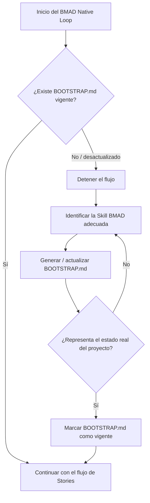
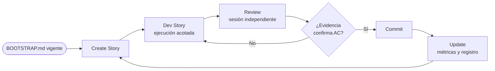

# BMAD Native Loop — Especificación del Framework

| | |
|---|---|
| **Versión** | v1.3 (especificación oficial) |
| **Estado** | Oficial |
| **Fecha** | 2026-07-25 |
| **Alcance** | Framework reutilizable, independiente de cualquier proyecto |
| **Ubicación canónica** | `docs/BMAD_NATIVE_LOOP.md` |
| **Origen de la evidencia** | Fase de Operational Readiness y validaciones posteriores en proyectos reales |

> Este documento es la **fuente de verdad permanente** del BMAD Native Loop como framework. Describe *cómo funciona el proceso*, no *qué se hizo en un proyecto concreto*. Los ejemplos derivados de un proyecto específico aparecen siempre marcados como **[Ejemplo ilustrativo]** y no forman parte de la especificación.

---

# Framework vs Proyecto

El BMAD Native Loop separa de forma estricta lo que pertenece al **framework** (estable, reutilizable, portable entre proyectos) de lo que pertenece a un **proyecto** concreto (variable, específico, no portable). Confundir ambos planos es el error que este documento existe para prevenir: un framework que absorbe detalles de proyecto deja de ser reutilizable, y un proyecto que redefine el framework deja de ser validable de forma cruzada.

| Framework (portable, este documento) | Proyecto (específico, no portable) |
|---|---|
| `docs/BMAD_NATIVE_LOOP.md` | `BOOTSTRAP.md` |
| Operational Readiness (fase y criterios) | Arquitectura |
| Taxonomía de incidencias | Roadmap / backlog de candidatos |
| Principios operativos | Sprint |
| Flujo del loop | Stories |
| Buenas prácticas | ADRs (decisiones de arquitectura del proyecto) |

**Regla de oro:** ningún artefacto de la columna izquierda puede depender de un proyecto para tener sentido; ningún artefacto de la columna derecha viaja entre proyectos sin reescribirse. El framework consume el contexto del proyecto a través de un único punto de entrada declarado: el `BOOTSTRAP.md` (ver [Incorporación de un proyecto](#incorporación-de-un-proyecto-project-bootstrap)).

---

# Propósito del BMAD Native Loop

El BMAD Native Loop es un flujo de desarrollo asistido por LLM que ejecuta unidades de trabajo pequeñas y verificables (**Stories**) con una garantía central:

> **El resultado nunca se acepta con base en lo que el agente ejecutor dice que hizo, sino con base en lo que el estado real del proyecto demuestra.**

El loop resuelve un problema concreto y recurrente del desarrollo asistido por LLM: los agentes pueden reportar éxito sin haberlo logrado, o fracaso habiendo tenido éxito. El loop neutraliza ese riesgo interponiendo **verificación independiente** entre la ejecución y la aceptación, y **acotando** lo que el agente ejecutor puede tocar mediante una allowlist positiva y explícita.

**Qué es:**

- Un pipeline determinista: resolver Story → renderizar prompt → ejecutar acotado → validar completitud → revisar de forma independiente → commit → actualizar.
- Un contrato de confianza basado en evidencia externa al agente (diff, compilación, revisión).

**Qué NO es:**

- No es un bucle automático de reintento sin supervisión (`/loop`).
- No es un sistema de Skills por Story ni de hooks de scope/DoD escritos a mano.
- No es un mecanismo que confíe en el autorreporte del ejecutor bajo ninguna circunstancia.

---

# Incorporación de un proyecto (Project Bootstrap)

## Por qué Project Bootstrap es parte del framework

Durante la validación quedó demostrado que el loop **no puede operar correctamente sin un contexto inicial del proyecto**. En repetidas ocasiones la ejecución de una Story dependió de hechos que debían existir *antes* de que el loop arrancara:

- **De dónde salen los candidatos de trabajo** (un roadmap o auditoría de progreso).
- **Cuál es el comando de verificación** del proyecto (compilación, tests, lint) que define si una Story está realmente terminada.
- **Qué convenciones de rutas** determinan el allowlist con el que se acota al ejecutor.
- **Qué stack, arquitectura y restricciones** condicionan qué es y qué no es una desviación aceptable.

Cuando ese contexto está disperso o ausente, el loop degrada de forma medible. **[Ejemplo ilustrativo]** en una Story cuyo comando de verificación no estaba declarado, el ejecutor gastó decenas de turnos y un costo significativo intentando verificar su propio trabajo con herramientas fuera de su alcance.

`BOOTSTRAP.md` es la **formalización arquitectónica** de esa necesidad: un único artefacto, propiedad del proyecto, que reúne el contexto que el framework necesita consumir. Su contenido evolucionará con cada proyecto, pero **el concepto es un prerrequisito oficial del framework**: el loop comienza verificando que exista un `BOOTSTRAP.md` vigente antes de iniciar cualquier Story.

## Contenido mínimo de un `BOOTSTRAP.md`

Un `BOOTSTRAP.md` vigente debe declarar, como mínimo:

1. **Comando(s) de verificación** — cómo se determina que el código sigue sano (p. ej. compilación, tests, lint), incluyendo el comando exacto.
2. **Convenciones de rutas y estructura** — dónde vive el código fuente, para derivar allowlists acotados de forma segura.
3. **Fuente de candidatos** — dónde se listan y priorizan las unidades de trabajo (roadmap, auditoría, backlog).
4. **Stack y restricciones** — lenguaje, frameworks, límites arquitectónicos y reglas de estilo relevantes.
5. **Definición de desviación aceptable** — qué ajustes menores puede hacer el ejecutor sin romper la intención de una Story.

## Gate de arranque

El loop **se detiene antes de la primera Story** si no hay un `BOOTSTRAP.md` vigente. "Vigente" significa que refleja el estado actual del proyecto, no un estado histórico. Ante su ausencia o desactualización, el loop no improvisa: identifica la Skill BMAD adecuada para generarlo o actualizarlo, produce el artefacto, verifica que represente correctamente el proyecto y solo entonces reanuda.

### El gate se evalúa al entrar y antes de cada Create Story, no de forma continua

El gate acota su alcance a **antes de iniciar una Story**: se evalúa al entrar al loop y de nuevo antes de cada `Create Story`. **No** es una comprobación continua ni un bloqueo concurrente.

Si el `BOOTSTRAP.md` queda desactualizado **mientras una Story ya está en curso**, eso no detiene esa Story: la Story en vuelo se cierra con su ciclo normal, y la actualización del Bootstrap se registra como **prerrequisito del siguiente `Create Story`**. Aplicar el gate de forma concurrente dejaría trabajo terminado y verificado sin cerrar, por un motivo ajeno a su alcance.

Ese prerrequisito debe quedar en un **destino durable** del proyecto — el mismo concepto que ya exige la disposición `defer` (ver [Disposición de hallazgos de Review](#disposición-de-hallazgos-de-review)). Un prerrequisito recordado solo en la conversación no es un prerrequisito.

---

## Separación de responsabilidades

| Artefacto | Propietario | Rol |
|---|---|---|
| `BMAD_NATIVE_LOOP.md` | Framework | Define *cómo* opera el loop. Igual en todos los proyectos. |
| `BOOTSTRAP.md` | Proyecto | Aporta *el contexto* que el loop consume. Distinto en cada proyecto. |

El framework nunca codifica dentro de sí el contenido del `BOOTSTRAP.md`; lo consume. El proyecto nunca redefine el flujo del loop; lo alimenta.

---

# Flujo completo del loop

Una vez satisfecho el gate de Bootstrap, cada unidad de trabajo recorre cinco fases: **Create Story → Dev Story → Review → Commit → Update**.

**Create Story** — se define una Story pequeña, con Acceptance Criteria (AC) numerados y explícitos, y con las notas de contexto que el renderizador necesita. La Story es la unidad atómica del loop.

Dos condiciones que la Story debe satisfacer desde su creación:

- **Cada AC es verificable al cerrar la Story.** Un AC cuya comprobación depende de trabajo futuro, de otra Story, o de una decisión humana todavía pendiente no es un criterio de aceptación: es un supuesto. Se mueve fuera de los AC y se registra como decisión pendiente, para que el veredicto de la Review no quede indefinido.
- **La Story declara su baseline de comparación** (ver más abajo), sin el cual la Review no puede verificar la contención de alcance.

**Dev Story** — la Story se convierte en un prompt y se ejecuta en un proceso **acotado por una allowlist positiva**: el ejecutor solo puede usar las herramientas y tocar las rutas declaradas. Todo intento fuera de la allowlist se deniega; el agente se adapta o se contiene, pero no escala su alcance.

**Review** — una **sesión fresca e independiente** (nunca una reanudación de la sesión ejecutora) verifica el resultado contra el estado real: el diff **contra el baseline declarado por la Story**, compilación cuando aplica, y cada AC. El revisor no confía en el ejecutor; confía en el árbol de trabajo. Su alcance de escritura es su propio artefacto de reporte: la Review no modifica el árbol bajo revisión.

**Commit** — solo tras confirmar que la evidencia respalda todos los AC y que no se tocó nada fuera de alcance.

**Update** — se registran métricas, incidencias y lecciones. Este paso es lo que convierte el loop en un sistema que aprende de evidencia real.

**Aislamiento entre fases.** Ejecución y Review corren en procesos separados, sin compartir contexto. Este aislamiento es deliberado y **no debe eliminarse ni simplificarse**: es lo que permite que la Review detecte un resultado que el ejecutor reportó de forma incorrecta.

## Baseline de comparación

Para que la Review pueda distinguir lo que la Story cambió de lo que ya estaba, la Story declara desde su creación un **baseline de comparación**: el identificador inmutable del estado del repositorio contra el que se medirá su diff (en un repositorio Git, el hash del commit base). El baseline se registra **en la Story misma**, no en la sesión de ejecución ni en la de Review — es un dato del contrato, no del proceso que lo consume.

Sin baseline declarado, el diff es ambiguo: un árbol que avanzó por trabajo adyacente, un rebase, o cambios previos sin commitear vuelven indistinguibles el alcance real de la Story y el ruido del entorno. El revisor entonces no puede afirmar *"no se tocó nada fuera de alcance"* — solo *"no veo nada anómalo"*, que es una afirmación distinta y mucho más débil.

Con baseline declarado, la Review obtiene dos comprobaciones que antes no eran posibles de forma rigurosa:

1. **Contención de alcance** — el conjunto de archivos que difieren respecto al baseline debe estar contenido en la allowlist declarada. Cualquier archivo fuera de ella es un hallazgo, sin discusión.
2. **Atribución** — cada cambio que respalda un AC es atribuible a esta Story, y no a trabajo previo heredado del árbol.

El baseline es además lo que hace operativa la lección de que una Review acotada al alcance declarado basta, sin necesidad de aislar cada Story en un árbol de trabajo dedicado (ver [Lecciones generales reutilizables](#lecciones-generales-reutilizables)).

## Estado registrado del loop

Cada fase del loop la ejecuta un rol distinto, y varias de ellas pueden tardar. Por eso el estado que la Story registra no puede limitarse a "en curso": debe identificar **qué fase está activa y qué rol la tiene en curso**.

> **Regla.** Un estado registrado que no permita distinguir *"el ejecutor sigue trabajando"* de *"la Review está corriendo"* no es un estado válido. La distinción es obligatoria; el vocabulario que la expresa lo define el **proyecto**, no el framework.

Sin esa distinción, el estado se registra de forma ad hoc y deriva: el seguimiento del sprint y el archivo de la Story acaban afirmando cosas distintas, y un lector concluye que el ejecutor sigue trabajando cuando en realidad la ejecución terminó y lo que corre es la verificación. Ese desfase no es cosmético: mientras exista, nadie puede saber a quién le toca actuar ni qué está esperando el loop.

Dos consecuencias prácticas:

1. **El vocabulario de estados del proyecto debe cubrir las fases del loop.** Si el proceso puede estar en una fase que el vocabulario no sabe nombrar, ese estado se registrará mal o no se registrará. Es responsabilidad del proyecto que su vocabulario sea completo respecto a las cinco fases.
2. **Se registra qué proceso desempeñó cada rol.** No basta con saber que hubo una Review: hay que poder comprobar que no la corrió quien ejecutó. Sin ese registro, una violación del aislamiento es indetectable después del hecho.

El framework no fija los nombres de los estados ni su representación. Fija que la distinción exista y quede registrada.

---

## Review multicapa (amplificación opcional)

La Review puede ejecutarse como **varias capas independientes** con enfoques distintos: una que audita los AC uno a uno, otra que busca casos borde, otra que busca huecos de verificación.

**El requisito del framework sigue siendo una única Review independiente.** La multicapa es una amplificación **completamente opcional** para Stories de mayor riesgo: no es un requisito nuevo ni un estándar nuevo del framework. Un proyecto que nunca la use cumple el framework por completo, y no usarla no es una desviación.

Cuando se usa, una sola regla es obligatoria:

> **Al menos una capa debe aportar evidencia de ejecución real.** Un conjunto de capas que solo inspeccionan de forma estática puede coincidir en un veredicto y aun así no descargar un AC: la coincidencia entre revisores no sustituye la evidencia del comando corrido.

Consecuencia práctica: un AC verificado únicamente por inspección estática se declara **implementado pero no verificado**, con esa distinción escrita explícitamente en la Story. No se declara aprobado.

El resto de los parámetros de la multicapa — cuántas capas, con qué enfoques, cómo ponderar la coincidencia entre ellas — todavía no tiene evidencia suficiente para fijarse en el framework; ver [Candidatos no validados](#candidatos-no-validados).

---

# Comandos BMAD asociados al loop

Esta sección traza qué comando oficial de BMAD se invoca en cada fase del loop. No es una lista exhaustiva del catálogo de BMAD — solo los comandos que el loop realmente dispara durante su ejecución. El loop no depende de estos nombres para funcionar: si el catálogo oficial de BMAD renombra o reemplaza un comando, esta tabla se actualiza; el flujo descrito arriba no cambia. Lo mismo aplica a su **conducta**: si la implementación concreta de un comando ofrece una acción que esta especificación prohíbe al rol que la invoca —por ejemplo, escribir en el árbol bajo revisión durante la fase de Review—, prevalece la especificación. Esto no concede autoridad nueva a nadie: [Roles y responsabilidades](#roles-y-responsabilidades) ya ata a cada rol con independencia de qué herramienta lo invoque.

El prefijo `/` indica que el comando se invoca como skill dentro del IDE (p. ej. `/bmad-create-story`); el nombre que sigue al prefijo es el nombre oficial del workflow de BMAD, sin alteración. El prefijo es solo la forma de invocación, no parte del nombre del comando.

| Fase del loop | Comando BMAD | Agente | Nota |
|---|---|---|---|
| Gate de Bootstrap | `/bmad-help` → `/bmad-generate-project-context` (cuando corresponda) | Analyst | El loop inicia consultando `/bmad-help`, el cual determina si es necesario ejecutar `/bmad-generate-project-context` u otra skill adecuada para satisfacer el gate de `BOOTSTRAP.md`. El framework no depende de un comando específico, sino del concepto de Project Bootstrap. |
| Create Story | `/bmad-create-story` | DEV | Crea el archivo de Story desde el epic correspondiente. |
| Dev Story | `/bmad-dev-story` | DEV | Ejecuta la implementación acotada por la allowlist. |
| Review | `/bmad-code-review` | DEV | Validación de calidad independiente tras Dev Story. |
| Commit | — | — | Acción de control de versiones; no tiene comando oficial en BMAD. Queda fuera del catálogo por definición. |
| Update | — | — | Registro de métricas e incidencias propio del loop; sin comando oficial equivalente. `/bmad-retrospective` opera a nivel de Epic, no de Story, y por tanto no sustituye este paso. El registro de métricas, incidencias y aprendizaje del Native Loop permanece como responsabilidad propia del framework. |

Esta tabla vive en el plano del **framework**: los nombres de comando son los del catálogo oficial de BMAD, no una convención inventada por el loop ni específica de un proyecto.

---

# Roles y responsabilidades

| Rol | Responsabilidad | Puede | No puede |
|---|---|---|---|
| **Autor de Story** | Definir la unidad de trabajo, sus AC numerados, su baseline y su contexto. | Fijar alcance y criterios de aceptación. | Ejecutar ni aprobar su propia Story, ni fijar AC cuya verificación dependa de trabajo futuro o de una decisión aún pendiente. |
| **Ejecutor** | Implementar la Story dentro de la allowlist. | Leer, editar los archivos declarados, adaptarse a denegaciones. | Salir de la allowlist, auto-otorgarse permisos, o ser tomado como fuente de verdad. |
| **Validador de completitud** | Confirmar de forma automática que el resultado dice cumplir la condición de la Story. | Evaluar la completitud declarada. | Sustituir a la Review independiente. |
| **Revisor independiente** | Verificar el resultado contra el estado real en una sesión fresca. | Leer diff/estado contra el baseline, comparar contra AC, emitir veredicto con disposición explícita por hallazgo. | Reanudar la sesión del ejecutor, confiar en su autorreporte, escribir en el árbol bajo revisión fuera de su propio artefacto de reporte, o crear una fuente que no existe. |
| **Orquestador humano** | Supervisar el loop, decidir sobre incidencias y cambios al framework. | Detener, corregir, escalar, aprobar cambios al loop. | Delegar la aceptación final en el autorreporte del ejecutor. |

Principio transversal: **ningún rol se verifica a sí mismo.** La aceptación siempre proviene de un actor distinto del que ejecutó, con acceso a evidencia externa.

---

# Principios operativos

1. **La verificación independiente está por encima del autorreporte.** El texto de resultado del ejecutor nunca basta. La aceptación se apoya en diff + compilación + Review en sesión fresca.
2. **Allowlist positiva y exhaustiva.** Se declara explícitamente lo permitido; todo lo demás se deniega. La allowlist contiene incluso intentos de auto-escalación de permisos.
3. **No optimizar por mejoras hipotéticas.** El loop solo cambia por fricción o defectos observados en trabajo real, nunca por una mejora imaginada.
4. **Estabilizar solo con evidencia real.** Las métricas y decisiones del framework se derivan de Stories ejecutadas, no de supuestos.
5. **Un cambio → detener, documentar, corregir, reanudar.** Ante un defecto real del loop, se detiene el flujo, se documenta la causa raíz, se corrige el mecanismo y se reanuda sin re-derivar el trabajo ya hecho.
6. **Aislamiento entre ejecución y verificación.** Procesos separados, sin fuga de contexto: es la condición que hace confiable el veredicto.
7. **No fabricar evidencia ni fuentes.** Ninguna fase del loop crea el artefacto que le falta para poder afirmar algo. Una fuente se verifica antes de citarse; una fuente ausente se reporta como hueco y **detiene** la afirmación que dependía de ella. Rellenar el hueco no es una contribución: es una falla de integridad.

---

# Fuentes de verdad

Cuando dos señales se contradicen, el framework resuelve el conflicto según un **orden de autoridad** fijo, de mayor a menor:

1. **Estado real del árbol de trabajo** — el diff contra el baseline declarado, y `git status`. Es la máxima autoridad: describe lo que efectivamente cambió, y respecto a qué punto de partida.
2. **Compilación / verificación del proyecto** — el comando declarado en `BOOTSTRAP.md` (compilación, tests, lint). Confirma que el cambio no rompe el proyecto.
3. **Review independiente** — el veredicto de la sesión fresca que contrasta el estado real contra los AC.
4. **Autorreporte del ejecutor** — la autoridad **más baja**. Se registra, pero jamás decide por sí solo la aceptación.

**[Ejemplo ilustrativo]** en una Story real, el ejecutor reportó `"Blocked. No change."` mientras el `git diff` mostraba el cambio aplicado de forma completa y correcta. El resultado se aceptó porque la fuente de verdad de rango superior (el árbol de trabajo, confirmado por compilación y Review) desmintió el autorreporte. Este caso es exactamente el que el orden de autoridad existe para resolver.

**Una fuente que no existe no es una fuente.** Antes de apoyar una afirmación en un artefacto, se verifica que el artefacto exista en el estado real del proyecto. Una cita a un documento ausente no es evidencia débil: es **ausencia de evidencia**, y se reporta como tal. Este orden de autoridad no admite un quinto nivel, por debajo del autorreporte, donde vivan las fuentes supuestas.

---

# Criterios para modificar el loop

El framework cambia con extrema parsimonia. Un cambio al loop solo procede cuando:

- Está **motivado por trabajo real**, no por una hipótesis de mejora.
- Corresponde a un **Loop Bug** confirmado (defecto en el mecanismo mismo), o
- Corresponde a un patrón de fricción que **cruzó el umbral de escalamiento**.

**Umbral de escalamiento.** Un patrón de fricción aislado no justifica modificar el loop. Solo cuando el **mismo patrón reaparece de forma reproducible en 2 o más Stories adicionales de la misma categoría** deja de tratarse como fricción y pasa a evaluarse como candidato a cambio del mecanismo. Un solo caso no es tendencia.

Todo cambio real al loop se registra cronológicamente con su causa raíz y su evidencia. Los cambios hipotéticos, por definición, no se aplican.

---

# Manejo de interrupciones

Una interrupción externa (por ejemplo, una llamada a herramienta cortada a mitad de ejecución) **no es un defecto del loop** y no se trata como tal. El protocolo de recuperación:

1. **El árbol de trabajo es la fuente de verdad.** Si el proceso interno ya escribió cambios antes de la interrupción, esos cambios existen en disco y son verificables.
2. **Comparar el diff resultante contra los AC.**
3. **Correr la verificación del proyecto** (compilación/tests) de forma directa.
4. **Ejecutar la Review** en sesión fresca, igual que siempre.

Si el diff, la verificación y la Review coinciden en que la Story está completa, se cierra con confianza **sin re-ejecutar** la Story completa (re-ejecutar sería redundante y arriesgado, ya que los archivos ya están en el estado correcto). Lo único que puede perderse en una interrupción es la confirmación formal del validador de completitud en la fase de ejecución; la Review independiente la sustituye como evidencia de aceptación.

---

# Disposición de hallazgos de Review

Esta sección clasifica los **hallazgos que la Review produce sobre el trabajo revisado**. Es un eje distinto del de la sección siguiente, que clasifica **incidencias sobre el loop mismo**: mezclarlos hace que un problema de proceso contamine el veredicto sobre un diff, o al contrario.

Un hallazgo de Review no es automáticamente un cambio a aplicar. Antes de cerrar la Review, cada hallazgo recibe una **disposición** explícita:

| Disposición | Qué significa | Dónde queda registrado | Estado de validación |
|---|---|---|---|
| **`patch`** | Corrección concreta, dentro del alcance declarado, que se aplica antes de cerrar la Story. | En el diff de la Story. | Validada en varias Stories y más de un proyecto. |
| **`defer`** | Hallazgo válido pero fuera del alcance declarado. No se aplica; se preserva. | Registro de trabajo diferido del proyecto. | Validada en varias Stories y más de un proyecto. |
| **`decision-needed`** | No puede resolverse sin una decisión del orquestador humano. Bloquea el cierre hasta que se decida. | La Story, hasta resolverse. | Categoría declarada; **aún sin caso real que la ejercite**. |
| **`Rejected by Design`** | Hallazgo técnicamente correcto que se rechaza a propósito, con su razón registrada. | La Story, junto a su justificación. | **Evidencia limitada** (un solo proyecto). |

**Reglas que acompañan a la taxonomía:**

- **Toda disposición se registra, incluidas las negativas.** Un hallazgo rechazado sin razón escrita es indistinguible de un hallazgo ignorado.
- **`defer` exige un destino durable.** Sin un registro de trabajo diferido propio del proyecto, la disposición `defer` degrada a "descartado en silencio" y el hallazgo se pierde entre Stories. El framework exige que el destino exista; su formato lo define el proyecto.
- **Un patch que expande el alcance se rechaza aunque sea correcto.** El caso observado de `Rejected by Design` fue exactamente este: mejoras válidas en sí mismas que introducían mecanismos nuevos no exigidos por ningún AC. Aceptarlas convertiría la Review en una vía para ampliar alcance sin pasar por Create Story.
- **La verificación se corre después de cada patch aplicado, no solo al final del lote.** Un lote verificado en bloque no permite atribuir una regresión al patch que la introdujo.

---

# Clasificación de incidencias

Toda incidencia observada durante una Story — es decir, todo lo que dice algo sobre el **loop**, no sobre el trabajo revisado — se clasifica en **una** de tres categorías, para no mezclar evidencia de naturaleza distinta. La clasificación determina dónde se registra y si cuenta como cambio al loop.

| Categoría | Qué es | ¿Cuenta como cambio al loop? |
|---|---|---|
| **Loop Bug** | Defecto real en el mecanismo del loop (scripts, prompts, validación, render). Requiere corregir el loop. | **Sí.** |
| **Operational Incident** | Interrupción externa al harness/sesión, no causada por el diseño del loop. Se recupera sin modificar el loop. | No. |
| **Executor Friction** | El ejecutor desperdicia turnos/costo intentando algo fuera de su allowlist (típicamente autoverificarse), pero la allowlist lo contiene correctamente — sin edits fuera de alcance ni fuga de permisos. | No, salvo que cruce el umbral de escalamiento. |

**Cómo distinguirlas:**

- Si el mecanismo del loop hizo algo incorrecto → **Loop Bug**.
- Si algo externo interrumpió un mecanismo por lo demás correcto → **Operational Incident**.
- Si el ejecutor se comportó de forma ineficiente pero la allowlist lo contuvo → **Executor Friction**.

**Escalamiento Executor Friction → Loop Bug:** si el mismo patrón de fricción reaparece de forma reproducible en 2+ Stories adicionales de la misma categoría, deja de ser fricción aislada y se evalúa como candidato a mejora del loop.

Una Executor Friction contenida **no es una falla de seguridad**: demuestra que la allowlist funciona. Pero se registra y se vigila, porque un intento de auto-escalación de permisos o un autorreporte falso, aunque contenidos, son señales que no deben minimizarse.

---

# Operational Readiness

Operational Readiness es la **fase de validación** en la que un equipo estabiliza el loop con evidencia de trabajo real antes de adoptarlo como flujo habitual. Durante esta fase **no se agregan features al loop**: solo se corrigen defectos que el trabajo real revela.

## Criterios de entrada

- El loop existe y es ejecutable de punta a punta (resolver → render → ejecutar → validar → review → commit).
- Existe un `BOOTSTRAP.md` vigente para el proyecto de validación.
- Hay trabajo real disponible que pueda descomponerse en Stories pequeñas y verificables.

## Criterios de salida

- **5–10 Stories reales completadas** (referencia, no umbral estricto).
- **Ninguna regresión** introducida por el loop.
- **Cero necesidad de volver a una arquitectura anterior** del proceso.
- Las modificaciones al loop estuvieron **motivadas únicamente por trabajo real**.
- **Tendencia decreciente** de cambios al loop a lo largo de las Stories.
- Diversidad de categorías de trabajo cubierta (no una sola clase de tarea).
- Confianza suficiente para documentar el framework como reutilizable.

## Evaluación continua

La fase **no se cierra por conteo**. Cada Story completada agrega una evaluación breve con cuatro preguntas:

1. ¿La Story aportó nueva evidencia sobre la estabilidad del loop?
2. ¿Se mantiene la tendencia decreciente de cambios al loop?
3. ¿Se validó alguna categoría nueva de trabajo?
4. ¿Qué evidencia falta todavía para declarar Operational Readiness finalizada?

La fase se cierra solo cuando el **historial completo** de Stories respalda con claridad los criterios de salida. Una sola incidencia relevante no resuelta (por ejemplo, un patrón de fricción sin entender si es aislado o estructural) es motivo suficiente para mantener la fase abierta.

---

# Lecciones generales reutilizables

Estas lecciones están abstraídas de la evidencia y son portables a cualquier proyecto. Los detalles de proyecto que las originaron se omiten deliberadamente.

1. **La verificación independiente es indispensable, no opcional.** El único mecanismo que atrapó un autorreporte de completitud falso fue la Review en sesión fresca contra el estado real. Eliminar o simplificar ese paso desarma la garantía central del loop.
2. **Nunca confíes en el texto de resultado del ejecutor, sea cual sea su contenido.** Tanto un "hecho" como un "bloqueado" pueden ser falsos. Solo el diff + compilación + Review deciden.
3. **La allowlist positiva contiene incluso la auto-escalación de permisos.** Un ejecutor puede intentar otorgarse permisos escribiendo configuración o sondeando el sandbox; una allowlist bien acotada lo deniega sin efecto. Contener no es lo mismo que prevenir el intento: hay que vigilar la recurrencia.
4. **La fricción del ejecutor suele nacer de contexto de proyecto ausente.** Cuando el comando de verificación no está declarado, el ejecutor intenta verificarse por vías no permitidas y desperdicia turnos/costo. Un `BOOTSTRAP.md` completo reduce esta fricción en origen.
5. **Instruir al ejecutor a "no hacer algo" no garantiza que no lo intente.** Mitigaciones basadas solo en instrucciones textuales pueden no evitar (o incluso empeorar) un comportamiento. La contención estructural (allowlist) es más fiable que la instrucción.
6. **El costo y la duración escalan con el tamaño real del cambio, no con la complejidad del mecanismo.** Útil para estimar: Stories más grandes cuestan proporcionalmente más, no exponencialmente más.
7. **La Review acotada a los archivos afectados basta para evitar el falso negativo del árbol sucio.** No hace falta aislar cada Story en un worktree dedicado si la Review compara solo el alcance declarado.
8. **El estado del árbol de trabajo es la mejor herramienta de recuperación ante interrupciones.** Permite cerrar una Story interrumpida sin re-ejecutarla, comparando el diff real contra los AC.
9. **Sin baseline declarado, "no se tocó nada fuera de alcance" no es verificable.** El revisor puede afirmar que no ve nada anómalo, pero no que el alcance se respetó. Declarar el baseline en la Story convierte esa afirmación en una comprobación mecánica.
10. **Un agente puede rellenar un hueco de información en vez de reportarlo.** Ante una fuente citada que no existe, el comportamiento observado no fue reportar la ausencia sino producir el documento faltante. Las fuentes se verifican antes de citarse, y una ausencia detiene la afirmación que dependía de ella.
11. **La contención por allowlist aplica también al revisor.** Acotar solo al ejecutor deja sin acotar precisamente la fase en la que se supone que se detectan los problemas. El alcance de escritura de la Review es su propio artefacto de reporte.
12. **Verificar después de cada corrección, no al final del lote.** Un conjunto de correcciones verificado en bloque no permite atribuir una regresión a la corrección que la causó, y obliga a re-derivar trabajo ya hecho.
13. **Coincidencia entre revisores no es evidencia de ejecución.** Varias capas de Review pueden converger en un veredicto sin que ninguna haya corrido la verificación del proyecto. Un AC solo se descarga con evidencia de ejecución real.
14. **Una señal de verificación verde puede convivir con una regresión real — y puede estar además amordazada sin que nadie lo note.** Se observaron ambas cosas en la misma épica: primero, una regresión visual auténtica con la compilación y el verificador de dependencias en verde, porque ninguno de los dos mide lo que la Story prometía preservar; después, que la configuración de build del proyecto suprimía **todos** los warnings, de modo que "verde y sin avisos" no era evidencia de nada. De ahí dos hábitos: la verificación debe **medir el artefacto**, no solo comprobar que el proceso terminó bien; y conviene comprobar de vez en cuando que una señal *puede* ponerse en rojo — una señal que nunca falla puede estar muerta.
15. **Separar los roles en procesos distintos correlaciona con aprobar en la primera Review.** En la Story donde autor, ejecutor y revisor recayeron en el mismo proceso hizo falta un ciclo de corrección completo; en las dos siguientes, con cada rol en un proceso sin contexto compartido, la Review aprobó a la primera y sin hallazgos que exigieran código. Evidencia limitada (tres Stories, un proyecto), por lo que se registra como lección y no como umbral: la separación de roles no es formalismo, tiene un efecto observable en el retrabajo.

---

# Evolución del Framework

El BMAD Native Loop es un **framework vivo**. Su estabilidad no significa inmovilidad, sino disciplina sobre *cómo* cambia:

- **Evoluciona únicamente mediante evidencia obtenida en proyectos reales.** Ninguna mejora entra al framework por ser plausible; entra por haberse manifestado como necesidad en trabajo real.
- **Las mejoras descubiertas durante la validación pueden formalizarse como parte oficial del framework** una vez que la evidencia es suficiente. Así fue como Project Bootstrap pasó de práctica emergente a prerrequisito oficial.
- **El framework no depende de ningún proyecto específico para evolucionar.** Los proyectos aportan evidencia; el framework abstrae de ella lo que es portable y descarta lo que es local.
- **Una decisión de diseño del framework puede formalizar un patrón observado aunque su implementación concreta siga refinándose** en proyectos posteriores. El *concepto* se vuelve oficial cuando la evidencia lo respalda; los *detalles* del mecanismo pueden seguir madurando sin invalidar el concepto.

Este documento es la versión **v1** de esa especificación. Las versiones futuras deberán registrar qué evidencia motivó cada cambio, preservando la trazabilidad entre el framework y los proyectos reales que lo hicieron evolucionar.

---

# Uso del Framework

`BMAD_NATIVE_LOOP.md` es el **punto de entrada del framework**. Adoptarlo en un proyecto nuevo consiste en leer esta especificación y luego preparar el contexto del proyecto que el loop consume. El flujo esperado:

1. **Abrir `BMAD_NATIVE_LOOP.md`** — leer la especificación para entender cómo opera el loop y qué garantiza. Es lo primero, siempre.
2. **Verificar la existencia de un `BOOTSTRAP.md` vigente** para el proyecto.
3. **Si no existe (o está desactualizado):**
   - identificar la Skill BMAD adecuada para generarlo;
   - generar `BOOTSTRAP.md`;
   - validar que represente el estado actual del proyecto.
4. **Comenzar la primera Story** una vez que el gate de Bootstrap está satisfecho.
5. **Ejecutar Operational Readiness cuando corresponda** — estabilizar el loop con evidencia real antes de adoptarlo como flujo habitual del proyecto.

El framework se lee una vez y se reutiliza en cada proyecto sin cambios; lo que cambia entre proyectos es el `BOOTSTRAP.md`, nunca este documento.

---

# Próximos artefactos del framework

El framework crecerá con artefactos oficiales adicionales. El siguiente en el roadmap:

**`BOOTSTRAP_TEMPLATE.md`**

- **Plantilla oficial** para nuevos proyectos que adoptan el BMAD Native Loop.
- **Implementación de referencia** del concepto de Project Bootstrap descrito en este documento.
- **Define la estructura mínima** que el BMAD Native Loop espera encontrar en un `BOOTSTRAP.md`.
- **Garantiza consistencia** entre proyectos: todos parten de la misma base y declaran el mismo contexto mínimo.

Este artefacto aún no está escrito; queda registrado aquí como parte del roadmap inmediato del framework.

## Candidatos no validados

Estas mejoras aparecieron en trabajo real pero **todavía no tienen evidencia suficiente** para formar parte de la especificación. Quedan registradas para no perderlas, y explícitamente **fuera** del framework hasta que la evidencia las respalde:

- **`Integrity Violation` como cuarta categoría de incidencia.** Un caso observado: una capa de Review, al no encontrar en el repositorio un documento que la Story citaba como fuente, **escribió** ese documento con contenido inventado y lo presentó como especificación oficial, en vez de reportar la ausencia; el artefacto se detectó y se eliminó antes del commit. Esa clase de incidencia — un agente que **consigue** producir un artefacto o una afirmación falsos que ningún mecanismo contuvo — no encaja con claridad en ninguna de las tres categorías vigentes: el mecanismo no falló, nada externo interrumpió, y no hubo contención. Proponerla como cuarta categoría queda **pendiente de más evidencia**: un solo caso, un solo proyecto. La taxonomía oficial permanece en tres categorías. La lección sí está adoptada (ver lección 10) y el principio operativo 7 cubre la conducta; lo que no se adopta todavía es la categoría.
- **Aplicación automática de patches por categoría.** Un experimento real delegó a reglas por categoría la decisión de aplicar o no cada `patch`, con condiciones objetivas de auto-aplicación. Resultado: la mayoría de las decisiones se delegaron sin regresiones, y los rechazos correctos fueron precisamente los que expandían alcance. Evidencia: un solo proyecto, una sola Story — por debajo del umbral de escalamiento del framework.
- **Escalonar el riesgo del patch según lo que modifica.** El mismo experimento sugirió que un patch que reescribe los AC ya aprobados es cualitativamente más riesgoso que uno puramente documental, y debería exigir mayor confianza antes de aplicarse. Observación de un solo caso, sin validación cruzada.
- **Condición formal de "evidencia suficiente" para cerrar la ejecución.** La propuesta: que el ejecutor entregue a Review en cuanto exista evidencia bastante para decidir, en lugar de seguir profundizando. La evidencia disponible **apunta en contra**: en las dos Stories medidas, el proceso que más consumió fue el **revisor**, no el ejecutor, que es donde el orden de autoridad quiere el trabajo profundo; y lo que un ejecutor produjo *más allá* de los criterios de aceptación fue precisamente el hallazgo más valioso de la épica (que la configuración de build suprimía todos los warnings), que esta regla habría suprimido. Riesgo de fondo: decidir que "ya hay evidencia suficiente" es una **autoevaluación del ejecutor**, la fuente de autoridad más baja. Además, las Stories de verificación son n=1: no hay con qué comparar. **No se adopta.**
- **Checkpoints automáticos en ejecuciones largas.** La propuesta: que una ejecución prolongada emita periódicamente criterios cubiertos, pendientes, riesgo y porcentaje restante, sin alterar su curso. La necesidad observada es real —una ejecución y su Review corrieron ~17 y ~20 minutos, opacas hasta terminar— pero **no se observó daño**: ni veredicto erróneo, ni salida de alcance, ni trabajo perdido; el costo fue solo de visibilidad. Dos objeciones de fondo: un porcentaje de avance es **autoevaluación del ejecutor**, y el *cómo* un agente reporta progreso es propiedad del harness, no del flujo. La necesidad parece de **observabilidad del entorno de ejecución**, no de una regla del loop. Un solo caso. **No se adopta.**
- **"Autoridad del orquestador" como principio operativo.** La propuesta: declarar que ante un conflicto entre la implementación de un workflow y esta especificación, el orquestador *limita o adapta* la ejecución. El caso observado —una herramienta de Review que ofrecía escribir en el árbol que revisaba— se resolvió correctamente haciendo prevalecer la especificación, es decir, **el mecanismo funcionó**: no hubo defecto. La palabra *adaptar* concedería además una licencia abierta para desviarse de cualquier workflow, invocable sin evidencia. Un solo caso, un solo proyecto, y no reapareció en las dos Stories siguientes. La parte que sí era ya-implícita se incorporó como aclaración editorial en [Comandos BMAD asociados al loop](#comandos-bmad-asociados-al-loop), sin conceder autoridad nueva. **El principio no se adopta.**
- **Parámetros de la Review multicapa.** Cuántas capas, con qué enfoques, y cómo ponderar la coincidencia entre ellas (ver [Review multicapa](#review-multicapa-amplificación-opcional)). Solo la regla de evidencia de ejecución real quedó validada; el resto, no.

---

# Apéndice A — Glosario

| Término | Definición |
|---|---|
| **BMAD Native Loop** | Flujo de desarrollo asistido por LLM basado en verificación independiente y ejecución acotada. |
| **Story** | Unidad atómica de trabajo, con Acceptance Criteria numerados y verificables. |
| **Acceptance Criteria (AC)** | Condiciones explícitas y numeradas que definen cuándo una Story está completa. |
| **BOOTSTRAP.md** | Artefacto propiedad del proyecto que reúne el contexto que el framework consume. Prerrequisito oficial del loop. |
| **Allowlist positiva** | Declaración explícita de las únicas herramientas y rutas que el ejecutor puede usar; todo lo demás se deniega. |
| **Verificación independiente** | Revisión en sesión fresca, sin contexto compartido con el ejecutor, contra el estado real del proyecto. |
| **Autorreporte** | Texto de resultado que produce el ejecutor. Fuente de verdad de rango más bajo; nunca decide por sí solo. |
| **Loop Bug** | Defecto en el mecanismo del loop. Cuenta como cambio al loop. |
| **Operational Incident** | Interrupción externa al mecanismo. No cuenta como cambio al loop. |
| **Executor Friction** | Ineficiencia del ejecutor contenida por la allowlist. No cuenta como cambio salvo escalamiento. |
| **Baseline de comparación** | Identificador inmutable del estado del repositorio contra el que se mide el diff de una Story. Se declara en la Story. |
| **Disposición de hallazgo** | Resolución explícita que la Review asigna a cada hallazgo: `patch`, `defer`, `decision-needed` o `Rejected by Design`. |
| **Registro de trabajo diferido** | Destino durable de los hallazgos con disposición `defer`, para que no se pierdan entre Stories. |
| **Review multicapa** | Ejecución de la Review como varias capas independientes con enfoques distintos. Amplificación opcional; exige al menos una capa con evidencia de ejecución real. |
| **Operational Readiness** | Fase de validación en la que el loop se estabiliza con evidencia real antes de adoptarse. |
| **Estado registrado del loop** | Estado de una Story que identifica la fase activa y el rol que la tiene en curso. El framework exige la distinción; el proyecto define el vocabulario. |
| **Orden de autoridad** | Jerarquía de fuentes de verdad: árbol de trabajo > verificación del proyecto > Review > autorreporte. |

---

# Historial de versiones

Cada versión agrega una entrada nueva sin modificar las anteriores, preservando la trazabilidad de cómo evolucionó el framework.

### v1

- Primera especificación oficial del BMAD Native Loop.
- Derivada de la validación durante Operational Readiness.
- Introduce Project Bootstrap como prerrequisito oficial del framework.
- Separa explícitamente Framework y Proyecto.

### v1.1

- Agrega la sección "Comandos BMAD asociados al loop", mapeando cada fase a su comando oficial de BMAD (invocado con prefijo `/`).
- No introduce cambios de arquitectura, principios ni flujo.

### v1.2

Evidencia: validaciones posteriores en proyectos reales que respaldaron la incorporación de los cambios descritos en esta versión.

- Corrige la **ubicación canónica** del documento a `docs/BMAD_NATIVE_LOOP.md`.
- Formaliza el **baseline de comparación**, declarado en la Story, como mecanismo de aislamiento de la Review; extiende Create Story, Review, el orden de autoridad y la tabla de roles en consecuencia.
- Exige que **cada AC sea verificable al cerrar la Story**; lo que no lo sea se registra como decisión pendiente, no como AC.
- Agrega la sección **"Disposición de hallazgos de Review"** (`patch`, `defer`, `decision-needed`, `Rejected by Design`), con el estado de validación declarado por disposición.
- Agrega el principio operativo **"No fabricar evidencia ni fuentes"** y extiende la contención por allowlist al rol de Review.
- **No adopta** `Integrity Violation` como categoría de incidencia: la taxonomía oficial permanece en tres categorías y el caso queda registrado en **Candidatos no validados**, pendiente de más evidencia. La lección derivada sí se adopta (lección 10).
- Introduce **Review multicapa** como amplificación **completamente opcional** — el requisito sigue siendo una única Review independiente — con una sola regla obligatoria cuando se usa: al menos una capa con evidencia de ejecución real.
- Agrega cinco lecciones reutilizables (9–13) y una sección de **candidatos no validados** para las mejoras aún sin evidencia suficiente.
- No modifica el flujo de cinco fases, el orden de autoridad, los criterios de Operational Readiness ni los criterios para modificar el loop.

### v1.3

Evidencia: una épica completa ejecutada de punta a punta bajo el loop, incluida su Story de verificación final (un *gate*). Los cambios de esta versión derivan solo de fricción o defectos observados en ese trabajo real; las propuestas sin respaldo suficiente quedaron registradas en **Candidatos no validados** y explícitamente **no** se adoptaron.

- Agrega la sección **"Estado registrado del loop"**: el estado de una Story debe identificar la fase activa y el rol que la tiene en curso, y debe registrarse qué proceso desempeñó cada rol. *Causa raíz:* en tres Stories consecutivas el estado se registró de forma ad hoc y derivó — el seguimiento del sprint y el archivo de la Story afirmaban cosas distintas, y en dos de ellas el vocabulario de estados del proyecto no tenía forma de nombrar la fase activa, de modo que "el ejecutor sigue trabajando" era indistinguible de "la Review está corriendo". El framework fija la distinción; el vocabulario sigue siendo del proyecto.
- Aclara que el **Gate de arranque** se evalúa al entrar al loop y antes de cada `Create Story`, **no** de forma continua: un `BOOTSTRAP.md` que caduca con una Story ya en vuelo no detiene esa Story, se registra como prerrequisito del siguiente `Create Story`, en un destino durable. *Causa raíz:* el texto anterior era ambiguo y podía leerse como bloqueo concurrente, lo que habría dejado sin cerrar trabajo terminado y verificado por un motivo ajeno al alcance del gate. Es desambiguación: no cambia el mecanismo.
- Extiende, en **"Comandos BMAD asociados al loop"**, la independencia respecto al catálogo desde los *nombres* hasta la *conducta*: si la implementación de un comando ofrece una acción que esta especificación prohíbe al rol que la invoca, prevalece la especificación. *Causa raíz:* una herramienta de Review ofrecía escribir en el árbol bajo revisión. Es aclaración editorial y **no concede autoridad nueva**: la tabla de roles ya ataba a cada rol con independencia de la herramienta.
- Agrega las **lecciones 14 y 15**: una señal verde puede convivir con una regresión real y puede además estar amordazada sin que nadie lo note; y separar los roles en procesos distintos correlaciona con aprobar en la primera Review (evidencia limitada, registrada como lección y no como umbral).
- Registra en **Candidatos no validados**, sin adoptarlas, tres propuestas evaluadas en la retrospectiva: una condición formal de "evidencia suficiente" para cerrar la ejecución (la evidencia apunta en contra), los checkpoints automáticos en ejecuciones largas (necesidad de observabilidad del harness, no del flujo; un solo caso) y la "autoridad del orquestador" como principio operativo (el mecanismo funcionó; un solo caso).
- **No modifica** el flujo de cinco fases, los roles, el orden de autoridad, la taxonomía de incidencias, las disposiciones de hallazgo, los criterios de Operational Readiness ni los criterios para modificar el loop.
